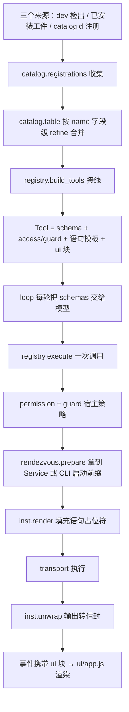

# 组件系统评审（COMPONENTS_REVIEW.md）

对当前组件系统的运行逻辑梳理，以及"哪里不优雅、哪里值得改"的清单。规范本身见
`COMPONENTS.md`；本文只讲现状与判断，每条问题都带证据（`文件:行`，标「实测」的
是我在仓库里跑探针验证过的行为）。

---

## 一、运行逻辑

### 1.1 一条声明的一生



1. **发现**：`catalog.registrations()`（catalog.py:390）按优先级收集三份声明 ——
   dev 检出（`checkout_registrations`，catalog.py:367，扫仓库根的**每个兄弟目录**）、
   本机安装层（`components.inventory()` + `read_manifest`，catalog.py:402-408）、
   `catalog.d/*.json`（catalog.py:409-413）。宿主自己不带任何声明。
2. **合并**：`catalog.table()`（catalog.py:416）按 `name` 做"字段级 refine"——
   后一份声明点名的字段覆盖，没点名的照旧（catalog.py:439-453）。
3. **接线**：`registry.build_tools()`（registry.py:208）先把 `run_command` 放进去，
   再逐个组件问 `rendezvous.available()`，可用的才把每个 `catalog.Tool` 经 `_wire`
   （registry.py:187）变成模型可见的 `registry.Tool`：描述/schema 过 `_resolve`
   填宿主事实（`$config.*` / `$skills` / `$backends`），`access` 经 `GUARDS`
   （registry.py:54）映射到守卫，`ui` 由 `catalog.ui_of` 补默认值。
4. **调用**：`ToolRegistry.execute`（registry.py:322）→ `_invoke`：先跑声明策略
   （`tool.guard`），再 `module_blocked_reason` 判断这个组件能不能为**这个工作区**服务，
   然后 `_exec_statement`：`rendezvous.prepare` → `inst.render` → transport → `inst.unwrap`。
   `snapshot` 语句在写之前由宿主记下旧内容，成功后 `workspace.snapshot()`（registry.py:428-441）。
5. **接口两种**：daemon 组件每个工作区一个常驻进程（loopback HTTP，`Service` + 发现记录
   + `/health` + `/shutdown`，rendezvous.py:377-410）；CLI 组件一次调用一个进程
   （`launch_prefix` 渲染出可执行前缀，rendezvous.py:295）。
6. **呈现**：`ui` 块随事件走（`ToolCallEvent.ui` / `ToolCallDeltaEvent.ui`，events.py:83/99），
   `ui/app.js` 里没有任何工具名，只按 `ui` 的键组合（app.js:322-350 `UI_DEFAULTS`）。
7. **安装**：`ui/components.js` → `POST /api/components/install`（manifest 走 base64 头，
   工件走 body）→ `supervisor._install_component`（supervisor.py:221）→
   `components.spool/accept/install`：摘要门 + 原子落地（`.installing` 改名）+
   清理其它版本 + 与工件自带声明合并（components.py:319-404）。安装完即注册
   （下一轮 `catalog.table()` 就看得见）。

### 1.2 进程与状态

| 状态 | 位置 | 生命周期 |
| --- | --- | --- |
| `_CACHE`（module, root, fences）→ Service | rendezvous.py:200 | 进程内，`release()`/`atexit` 清 |
| `_FENCED`（module, root）→ fence globs | rendezvous.py:208 | 进程内 |
| `_PROCS` pid → Popen | rendezvous.py:204 | 进程内，`_reap` 后移除 |
| 发现记录 `<prefix><sha256(root)>.json` | `_record_path`，rendezvous.py:434 | 组件写、宿主读 |
| 安装目录 `<root>/<name>/<version>/` | components.py:319 | 跨会话持久 |

---

## 二、问题清单

### P0-1　`catalog.table()` 没有任何缓存，且在热路径上反复全量扫盘

`table()`（catalog.py:416）每次调用都重新走 `registrations()`：扫仓库根的兄弟目录、
遍历安装根并逐个 `read_manifest`、glob `catalog.d`。而它被调用得非常密：

- `build_tools` 自己调一次（registry.py:217），然后**每个组件**再经
  `rendezvous.available → unavailable_reason → table() + resolve() → table()` 各两次。
- **实测**：仓库现状（4 个组件）`build_tools()` = **9 次** `registrations()` 全量扫描。
- **实测**：`reg.execute(...)` 一次调用（grep / web_fetch 各测一次）= **6 次**全量扫描
  （`module_blocked_reason` 里 4 次 + `prepare` 里 1 次 + 顶层 1 次）。
- 成本现在只有几毫秒（dev 层 4.2ms），但这是**结构**问题：开销随组件数 × 2 线性增长，
  而且每次工具调用都做一串 stat + JSON 解析 + 目录遍历。同一份数据在一轮 turn 里被解析几十次。

现有对照：技能库恰恰有缓存（`registry._skills → skills.cached_library`，registry.py:165），
组件表却一次都没有。

**建议**：`table()` 加进程内缓存 + 明确的失效点（安装完成、`CLUTCH_*` 环境变量变更、
显式 `catalog.invalidate()`）；`build_tools` 一次取表到处传，不要在函数内部互相重复取。
顺带把 `registrations()` 里的重复 I/O 合并：`inventory()` 已经读过每个 manifest，
`catalog.registrations` 又 `modules.component_dir()` + `read_manifest` 读一遍
（catalog.py:402-408，实测量化：`build_tools` 里 `read_manifest` 4 次 / `installed` 5 次）。

### P0-2　声明词汇表的失败方向自相矛盾：一个词不认识就**静默失效**（并且是 fail-open）

同一份声明里三种"宿主定义的词"，处理方式各不相同：

| 词 | 不认识的后果 | 代码 |
| --- | --- | --- |
| `access` | `GUARDS.get(access)` → `None`，**没有守卫**；`permission.GUARDED_ARG.get()` 也取不到 → 权限引擎按"无策略"放行 | registry.py:196、permission.py:96 |
| `gate` | `_gate_ok` 落到 `return False`，工具**永不提供**（fail-closed） | registry.py:172-185 |
| `ui` 的键 | `ui_of` 只保留 `UI_KEYS` 里的，其余**静默丢弃**（打错 `summery` 就退化成默认外观） | catalog.py:457-465 |
| `requires` | 未知设施被忽略，组件"可用" | rendezvous.py:222-253 |

**实测**（把 `access` 写成 `"Read"` 这种大小写手误）：

```
access='read'     -> protected-path guard: refuses   permission: allow
access='Read'     -> protected-path guard: NO GUARD  permission: allow
access='Write'    -> protected-path guard: NO GUARD  permission: allow
access='readonly' -> protected-path guard: NO GUARD  permission: allow
```

即：一个词的拼写错误，就**静默拆掉了宿主对 .clc 的保护**（`filesystem._refuse_protected`
是唯一挡住"点名读 .clc"的地方，且只在 `tool.guard` 存在时生效），也拆掉了权限引擎的
ask/deny 规则。`catalog_test.py` 的文档字符串已经把这个事实写下来了
（"A value outside the vocabulary is silently unguarded"）——但它是**当成已知行为**写的，
不是当成要被修掉的缺陷。

**建议**：把"声明词汇表"集中成一个可校验的表（`access` ∈ GUARDED_ARG、`gate` ∈
{"project","skills"}、`ui` 的键 ∈ UI_KEYS、`requires` ∈ 设施表），在 `_wire` / 装表时校验：
不认识的词 → 报错即数据（拒绝该工具、或保留工具但记一条诊断），至少不要 fail-open。
这与项目里"error as data / fail-closed"的其它地方（`inst.render` 的占位符、
`components.verify`、摘要门）是同一条原则。

### P0-3　daemon 的三张全局表编码同一件事，且以 fence 做缓存键 → 交替 fence 时每次都杀进程重启

`_CACHE`（键含 fences）/ `_FENCED` / `_PROCS`（rendezvous.py:200-208）分散维护
"这个 (module, root) 的守卫是谁、fence 是哪份、子进程句柄在哪"，要靠 `release()`/
`release_all()`/`_start()` 三处手写同步。而 `service()` 的判定是：

```
remembered = not fences or _FENCED.get((module, root)) == fences   # rendezvous.py:398
if seen is not None and remembered and _healthy(seen): 复用
if record is not None: _stop(...)                      # 否则杀掉重启
```

两个后果：

1. **跨进程/重启必然重启**：`_FENCED` 只活在进程内，只要工作区有受保护路径
   （打开项目就有 `.clc`），另一个 Clutch 窗口或重启后的宿主第一次调用就会**杀掉**
   一个健康的 daemon（rendezvous_test.py:224 把这个行为当作正确性钉住了：宁可重起也不信记录）。
2. **交替 fence 会让每次调用都重启**。**实测**：两个 fence 集合 A/B 交替请求
   （两个窗口各自打开同目录下不同的 .clc，或同一个宿主进程里 `protect()` 集合变化）：

```
A (first): pid=6300  58ms
A (again, same fence): pid=6300   1ms
B (changed fence): pid=6305  570ms
A (back to the first fence): pid=6310  570ms
B (back to B): pid=6316  569ms
A (and again): pid=6321  569ms
```

每一次调用都是"杀旧 daemon + 起新 daemon + 等就绪"。原因不只是 fence 变了，
而是**陈旧 key 从不清理**：A 的 key 里存的 pid 早就死了，于是走到 `_read_record`
拿到 B 的 daemon，再按"fence 不匹配"把它杀掉，起第三个 —— 而不是认出"B 的 daemon
就是我刚起的、A 只是过时的 key"。

**建议**：把三张表合成一个 `@dataclass Handle{service, fences, proc}`，缓存键退化成
`(module, resolved_root)`；换 fence 时**按 (module, root) 失效所有别名**，再决定
杀掉还是沿用。同时考虑把 fence 写进发现记录（记录由持有者签名/校验 pid+token 即可），
这样重启和第二个窗口不必杀掉健康的 daemon。这条改动的收益是可测的（570ms → 1ms）。

### P1-4　信封 `{content, error, diff}` 没有单一类型，只靠调用方 `setdefault` 补齐

- `inst.unwrap`（inst.py:200-222）的**五个返回分支里有四个只有 `content`**
  （HTTP 错误、不可达、非信封成功、非信封失败），只有信封分支带全三键。
- `transport.failure_envelope`（transport.py:53）自己造一份。
- `ToolRegistry.execute`（registry.py:389-394）最后再来一遍
  `result.setdefault("error"/"diff")`。

**实测**：`unwrap(CommandResult(0, "ok", ""))["error"]` → `KeyError`，
而它的文档字符串写的是"unwrap turns a finished command into {content, error, diff}"。
断言"每个结果都有三键"的地方只有 `execute`，其它调用者（测试、未来的调用点）会踩空。

**建议**：定义一个 `Envelope`（dataclass 或 NamedTuple，带 `to_dict()`），
`unwrap`/`failure_envelope`/`execute` 全部返回它，normalize 只在一处发生。

### P1-5　curl 与"最后一行三位数字"的启发式把传输细节焊进了协议

- `Service.vars()` 给模板塞 `"status": "\\n%{http_code}"`（rendezvous.py:190）——
  这是 curl 的 `-w` 语法，成了宿主要给组件的事实之一；`requires: ["curl"]` 与
  `unavailable_reason` 里的"没有 curl 就不能驱动 daemon"（rendezvous.py:245-250）也由此而来。
- 反向解析在 `inst.unwrap._body_and_status`（inst.py:186-197）：**stdout 最后一行是
  3 位数字就当成 HTTP 状态**。这条规则对所有组件生效，包括 CLI 组件。
- **实测**：一个合法输出以三位数字结尾，就被判成"服务回答了 HTTP 404"并且**丢掉真实输出**：

```
stdout='file count: 3\n404\n' -> error=True content='ERROR: clutch-x answered HTTP 404: file count: 3'
```

- 讽刺的是宿主**本来就用 urllib** 做 `/health` 探测和 `/shutdown`（rendezvous.py:496-521）。

**建议（已按"一切皆组件"原则修正，见第三章）**：**不是**把 loopback HTTP 收归宿主——那等于把
HTTP/POST/JSON/token-header/path 路由这些组件协议知识搬进宿主，恰好违反"组件实现与宿主无关"。
正确方向是让宿主**忘掉**组件协议：

- `{auth}`（`X-Clutch-Token:<token>` 的 header 拼法）与 `{status}`（curl 的 `-w` 语法）**退回组件的语句文本**；
  宿主只发布**事实**（`{port}`、`{token}`、`{pid}`）。
- `_body_and_status` 的"末行三位数字"整个删掉：输出只认信封与退出码（`inst.py:28-31` 已经这么写着）。
- `_healthy`（GET /health）与 `_stop`（POST /shutdown）从宿主生命周期里移除：就绪改判
  "**记录出现 + pid 存活**"（`_read_record` 本来就在做 `_pid_alive`，`rendezvous.py:457`），
  停止按记录里的 pid 终止进程。可选进阶：记录里带 `ready` / `stop` 语句，宿主用同一个渲染器跑它。
- `requires: ["curl"]` **保留**——组件声明它脚下的宿主设施，正是"声明随组件走"。

这样上面那条实测的误伤自然消失（CLI 输出不再被解释成状态码），宿主反而少了两处协议知识。
若短期不动，至少按 `interface` 限定启发式（`registry.py:465` 已经知道 `tool.module`），
别让"最后一行恰好是 404"变成协议。

### P1-6　合并逻辑是手写的字段列表，且"是否点名字段"有三种判定

`catalog.table()` 的 refine（catalog.py:439-453）逐字段写死：

- 有的看**原始 dict**：`declared.interface if data.get("interface") else known.interface`；
- 有的看**解析后的对象**：`declared.launch if declared.launch.argv or declared.launch.binary else known.launch`；
- 有的用 `or`：`requires=declared.requires or known.requires`、`directory=declared.directory or known.directory`。

三个后果：(a) 空值无法"显式清空"（`requires: []` 被当成"没点名"）；(b) `launch` 只能
整体替换——薄 manifest 想只改 `binary` 也得重述 `argv`；(c) `ui={**known.ui, **declared.ui}`
是**深合并**，其它字段是**整体覆盖**，同一份协议里两种语义。
另外 `Component(...)` 是逐字段重建：**以后给 `Component` 加一个字段，忘了同时改这段 merge，
新字段会被静默重置成默认值**（`_wire` 之于 `catalog.Tool` 同理，registry.py:194-204）。

**建议**：改成"点名即覆盖"的通用实现——用 `dataclasses.replace(known, **{f: v for f in
named_fields(data)})`，`named_fields` 只看原始 JSON 点了哪些键（这就是协议里真正想表达的）；
`launch` 也走同样的字段级逻辑。

### P1-7　工具名冲突与"声明被拒"全都没有声音

- **实测**：两个组件各声明一个 `dup` 工具 → `ToolRegistry.__init__` 的
  `{t.name: t for t in tools}`（registry.py:324）**后者静默覆盖前者**，模型只看到一个
  schema，也没有任何提示。第三方组件重名（`search`、`status` 这种）是很现实的场景。
- `_component_of` / `_tool_of`（catalog.py:291/332）对损坏的声明一律 `return None`：
  `interface` 打错一个字母 → 整个组件不存在；`description` 不是字符串 → 工具静默消失；
  manifest 是坏 JSON → 静默跳过。而协议里明明有"缺席要解释"的机制
  （`ui.status` + `components_unavailable`，registry.py:229）——它只覆盖"工件不在，
  不覆盖"声明读不懂"。

**建议**：把"拒绝原因"收集起来（`table()` 返回 `(components, refusals)` 或把诊断挂到
一个 host 侧列表），让 UI 能说"clutch-x 的 manifest 第 N 个工具缺少 description"；
工具重名在 build 时就报告（error as data），不要 last-wins。

### P1-8　CLI 组件的 cwd 是宿主仓库根，daemon 语句的 cwd 是工作区根

`rendezvous.prepare`：CLI 组件的 runner 是 `LocalTransport(str(modules.repo_root()))`
（rendezvous.py:348），而 daemon 语句走 `workspace` 这个 transport（cwd = 工作区根）。
**实测**（工作区 `/tmp/probe-ws-*`）：

```
workspace root: /tmp/probe-ws-ehnq9bmm
CLI statement runner cwd: /home/fanshu/Workplace/Clutch      ← 宿主的源码目录
```

对第三方 CLI 组件来说，一个跟它毫无关系、甚至可能不存在的目录成了相对路径基准；
而 `subject: workspace-fs` 的 CLI 组件按语义应该以工作区根为 cwd。
现在几个内置 CLI 组件恰好都用绝对参数（`--endpoint`、`--root`），所以这个问题是**潜伏**的，
但它是"同一个协议两个 cwd 语义"的不一致。

**建议**：cwd 由 `subject` 决定并显式写下来（`workspace-fs`/`project-file` → 工作区根，
`network`/`skill-library` → 宿主仓库根或组件自己的目录），或干脆加一个 host fact（`{cwd}`）
让声明自己说要什么。

### P1-9　声明里存在"只有解析、没有使用者"的字段

`runs_on`（catalog.py:79 起）被解析、被合并，但全仓库没有一处**读**它；
`catalog.OTHER` 没有引用者，`catalog.FOREIGN_FS` 只在 `serves_workspace_fs` 的注释里出现。
唯一的跨机器分支是 `registry.module_blocked_reason` 里写死的 LocalWorkspace 判断 +
`TODO(ssh-workspace)`（registry.py:293-300）。

**建议**：要么让它有消费者（`runs_on=other` → 走远端/通道，或至少在
`module_blocked_reason` 里给出"这个组件不在本机运行"的解释），要么从协议里删掉、
等实现时再加。留着会造成"文档承诺 > 代码能力"的错觉。

### P1-10　`requires: ["python"]` 的判定靠 `"{py}" in launch.argv[0]`

```python
if resolved.template and "{py}" in mod.launch.argv[0] and modules.python_missing():
```

（rendezvous.py:250-253）一个声明了 `requires: ["python"]`、但模板写成
`["/usr/bin/env", "python3", "{script}"]` 或 `["{py}", "-m", "pkg"]` 之外的形状的组件，
拿不到"本机没有解释器"的解释；反之一个没声明 python 需求但用了 `{py}` 的组件行为相反。
`requires` 是个字符串词汇表，实现却靠模板文本猜。

**建议**：设施 → 检查函数的显式表（`{"python": needs_python, "curl": needs_curl,
"posix-shell": needs_posix}`），`python` 的需求直接由"模板用到 `{py}`"推导，
而不是让组件手写一个可能与模板矛盾的字串。

### P2-11　`catalog.Tool` / `registry.Tool` 同名不同物，字段列表有三份

`catalog.Tool`（声明）与 `registry.Tool`（接线后的工具）名字完全一样，读
`from . import catalog` 与 `from .registry import Tool` 的代码要在脑子里切换语义。
加上 `_component_of`（catalog.py:291）、`_tool_of`（catalog.py:332）、`_wire`
（registry.py:187）三处逐字段搬运，新字段要改三处（见 P1-6）。

**建议**：声明侧改名 `ToolDecl` / `ComponentDecl`（或 `Decl` 后缀），
搬运改成"声明是 dataclass + `replace`/构造器集中一处"。

### P2-12　UI 默认值有两份，且 `mutates` 的默认值还不一样

Python 侧 `catalog.DEFAULTS`（catalog.py:139-150，**没有** `mutates` 键，
由 `registry.ui` 算），JS 侧 `ui/app.js` 的 `UI_DEFAULTS`（app.js:322-335，
`mutates: true`）。宿主其实已经把默认值填好随事件发出（`ui_of` + `registry.ui`），
JS 那份是第二实现；两份漂移时没人会发现（`mutates` 已经是不同默认的实例）。

**建议**：JS 只对"宿主没给 ui 块"的旧事件兜底，并把兜底表从 Python 侧生成/校验
（或加一条测试比对两份键集）。

### P2-13　`ToolResultEvent` 不携带 `ui`，分页回放会静默降级

`ToolResultEvent`（events.py:102-108）没有 `ui` 字段；`ui/app.js` 的 `uiOfResult`
（app.js:346-350）靠 `toolCalls[tool_call_id]` 找回声明，注释说"an older log page
renders from its own copy"，但**结果事件里根本没有那份拷贝**，于是落到
`UI_DEFAULTS`：`body: "diff"` 的写结果会按纯文本渲染，"read 行"也变回普通块。
分页（懒加载历史）场景下组件声明的呈现会丢失。

**建议**：`ToolResultEvent` 也带上 `ui`（与 `ToolCallEvent` 对称，小字段、可回放），
或者 UI 在分页不足时按 tool_call_id 去日志里补。

### P2-14　`components.installed()` 用字符串最大值当"最新版"

`max(found)`（components.py:115-138）对 `("0.9.0", path)` / `("0.10.0", path)`
做**字典序**比较。**实测**：同时存在 0.9.0 与 0.10.0 时解析结果是 **0.9.0**。
平时 `_prune` 只留一个版本，所以不常暴露；但一旦出现手工拷贝、失败的 prune、
或未来的多版本需求，解析就会选错。

**建议**：要么老实实现版本比较（或明确"只允许一个版本"并在多版本时给出诊断），
要么把最近的安装记在一个单独的 `current` 指针里而不是靠字符串排序猜。

### P2-15　归档解包可以更省事也更严

`_unpack`（components.py:412-431）手写逃逸检查，`_refuse_escape`（components.py:433）
只查 `/` 前缀与 `..`：不覆盖 Windows 驱动器/UNC 拼写（`C:/x`、`//host/share`），
也不拒绝 FIFO/设备文件成员。Python 3.12+ 有 `tarfile.extractall(filter="data")`
（3.14 起是默认），能一次覆盖绝对路径、`..`、设备文件与符号链接。
项目声明 `requires-python >= 3.10`／`.python-version` 是 3.10，所以要用特性探测。

**建议**：`filter="data"` 可用时优先使用，保留现有检查作为 3.10/3.11 的回退；
zip 侧至少补驱动器/UNC 形态。

### P2-16　dev 检出发现扫"仓库根的每个兄弟目录"

`checkout_registrations`（catalog.py:367-388）遍历仓库根的每个子目录并尝试读
`component.json`——包含隐藏目录、`dist`、`node_modules` 之类。语义上"把检出放在
Clutch 仓库旁边"就自动成为组件是个不错的设计（无需注册），但它①每轮 turn 重复做
（见 P0-1）②对同名的第三方目录没有冲突提示。配合 P0-1 的缓存，这条会自动变便宜。

### P2-17　安装记录里把 wire manifest 的未知字段原样写进 `component.json`

`install` 写盘的是 `{**manifest, name, version}`，`_merge_declaration` 返回
`{**declared, **wire}`（components.py:359-403）——于是上传方 manifest 里的任意键
（`digest`、`artifact` 以及未来任何拼错的键）都会成为"已安装组件的声明"。
`_component_of` 只读自己认识的键，所以现在无害，但"安装记录"和"组件声明"两种东西
混在同一个扁平字典里，审计时很难分清哪一行是组件自己写的、哪一行是安装器写的。

**建议**：给记录分层，例如 `{"declaration": {...}, "install": {"version", "digest",
"artifact", "installed_at"}}`，读回时只把 `declaration` 当声明。

### P2-18　零碎但值得记一笔

- `ToolRegistry._cancelable` 靠 `inspect.signature(t.host)` 里有没有 `cancel` 参数
  （registry.py:326-330）：隐式约定，用 `**kwargs` 的宿主工具会被漏判；一个显式
  `Tool.cancelable: bool` 更直白。
- `ToolRegistry.ui()` 对**不在表里**的工具返回 `{**DEFAULTS, "mutates": True, "undo": False}`
  （registry.py:360-361）：为一个不存在的工具编造外观，而且 `mutates=True` 与
  "宿主推导"的语义不一致。
- `_coerce_types`（registry.py:467-485）只处理 `integer`，就地修改 `args`；
  `boolean`/`number` 等类型仍然原样透传（注释也承认"models sometimes pass strings"）。
- `host_vars` 的 NB 注释（rendezvous.py:279）指出"宿主事实的键绝不能和工具参数重名，
  否则静默覆盖模型的值"——这是协议里的一个隐式约束，没有校验。声明里应该直接拒绝
  重名（`vars` 的键 ∩ 参数名 ≠ ∅ → 拒绝该工具）。
- 文档漂移：`agent/tools/filesystem.py` 开头仍说四个文件工具"declared in tools/catalog.py"
  （现在宿主零内置声明了）；`agent/tools/__init__.py` 仍是
  "Tool implementations: registry + workspace + filesystem + shell tools."。
  这两处与 `COMPONENTS.md` 的定调相反，会让新读者以为宿主还有一份实现。

**已落地**（`a01e74a` fix(tools): the wiring declares what Stop reaches, and a bad
argument is named）：`Tool.cancelable` 由接线处声明
（不再 `inspect` 猜 `cancel`）；`registry.ui()` 对不认识的工具只回默认值 + `undo: False`，
不再编造 `mutates`；`_coerce_types` 覆盖 `integer`/`number`/`boolean` 三种标量，拼不出
声明形状的一律当无效参数；`vars` 的键与该工具某个参数重名的声明在接线时被拒绝
（`catalog.component_diagnostics`）；`tools/filesystem.py` 与 `tools/__init__.py` 的
docstring 改口。

---

## 三、宿主的协议知识审计（协议由谁提供）

本次讨论确立的判据：

> **一切皆组件**：组件怎么实现与宿主无关；宿主只知道"一段被封装的语句可以和组件交互"；
> 宿主最多管理组件的**启动与终止**。协议由**组件侧**提供，宿主只规定"**协议的协议**"
> （词汇、位置、形状、封装规则），而这份"协议的协议"的具体实现应当由**配置文件或其他外部方式**
> 提供；宿主不硬编码任何工具的具体封装。

**结论：前一半成立，后一半当时不成立。** 协议确实随组件走（3.1）；但宿主里躺着 6 处具体
工具/具体组件的知识（3.2），且"实现由配置文件提供"当时是 0 分（3.4，第五步已落地）。

### 3.1 成立的一半：协议确实由组件提供

| 要素 | 由谁提供 | 证据 |
| --- | --- | --- |
| 工具的 schema / 描述 | 声明（宿主只做 `$` 事实替换） | `registry.py:187-205` |
| 工具怎么执行 | 声明的语句文本 + 宿主渲染/传输 | `inst.render`、`registry.py:437-465` |
| 输出协议 | 组件打印的 `{content,error,diff}` 信封 | `inst.py:28-34` |
| 界面呈现 | 声明的 `ui` 块；`ui/app.js` 里**没有**任何工具名/组件名 | `COMPONENTS.md:131-132`，已 grep 复核 |
| daemon 的寻址 | 组件发布的记录（port/pid/token），宿主只读 | `rendezvous.py:434-459` |
| 组件从哪里来 | 文件驱动：安装根 + `catalog.d/*.json` | `catalog.py:276-288` |
| 接入新组件要改宿主代码吗 | 基本不用（例外见 3.2） | 无 `if tool.name == …` 调度分支 |

### 3.2 不成立的一半：宿主里的 6 处具体封装

| # | 位置 | 宿主在说什么 |
| --- | --- | --- |
| ① | `registry.py:254-273` + `prompts/tools/run_command{,/_chat}.md` + `shell.py` | **唯一的硬编码工具**：`run_command` 的名字/描述/schema/实现/access/ui 全在宿主里（`COMPONENTS.md:3` 承认它是例外） |
| ② | `permission.py:40`、`filesystem.py:44/49/55`、`registry.py:108/315`、`core/context.py:41/47` | 硬编码了具体参数的**参数名** `path`：guard、undo（`snapshot`）、"最近碰过的文件"都按这个名字找。组件把目标参数叫 `file`/`url` 就拿不到 guard 与 undo——这是 P0-2 fail-open 的另一面 |
| ③ | `catalog.py:264` `_BACKENDS`、`catalog.py:267-270`、`config.py:87-98` | 宿主替 **clutch-websearch** 决定"网络搜索有哪些后端"（`tavily/searxng/bing/ddg`），那是那个组件的域内词汇 |
| ④ | `agent/skills.py:42/48/55-60`、`core/context.py:172-176`、`registry.py:165-183` | 宿主为 **clutch-skills** 保留了**第二份实现**（自己扫 `*/SKILL.md`）：与 `COMPONENTS.md:5-6` 的"宿主不为任何组件保留第二份实现"直接冲突 |
| ⑤ | `modules.py:40-43`、`config.py:127` | 默认配置按名字指向具体组件（`component_dir(modules.SKILLS)/"skills"`），注释却说"never a host-side registration" |
| ⑥ | `prompts/system.md`、`prompts/mode_work.md:4/7`、`prompts/errors/interactive_hint.md` | 宿主提示词的流程文字里写死了具体工具名；组件缺席/改名/被第三方替换时会漂移 |

其中 ② 与 ④ 是"宿主为具体工具写具体代码"的直接证据，危害也最大：
② 让 guard/undo 只对恰好把参数叫 `path` 的组件生效（未知 `access` 词还静默无守卫）；
④ 让技能库存在两份真值。

① 已落地（第七步）：`run_command` 仍是宿主自己的工具，但它现在是**被声明**的——
`agent/tools/host.py` 里一份与第四节同形的数据，由同一个解析器（`catalog.tool_of`）
读入、同一套诊断（`catalog.tool_diagnostics`）校验，描述取自宿主自己的提示词文件
（`prompts/tools/run_command{,/_chat}.md`）；"是不是组件"这件事只剩一个差别，就是
实现（`shell.run_command`）随声明一起由宿主提供，而不是组件自己的一条语句，而策略
（`access: "command"` → 权限引擎、只读分类、逃逸与 .clc 保护、Stop）依旧全在宿主这边。
名字进了 `catalog.HOST_TOOL_NAMES`：组件声明同名工具会被拒绝
（`component_diagnostics` 报 fatal），"模型看到的 `run_command` 是谁的"因此不再取决于
安装顺序；宿主声明与词汇表在导入时互校（`registry._check_vocabulary`）。见
`COMPONENTS.md` 第十一节。

④ 已落地（第六步）：技能目录不再有第二份实现。`agent/skills.py` 整份删除，
`core/context.py` 里那段"自己扫 `*/SKILL.md` 再拼目录表"的代码与它的 import 一起消失；
宿主留给自己的只剩"问谁、怎么问"（`catalog.FACT_TOKENS = ("skills",)`），答案由组件
**发布**：声明里 `"facts": {"skills": "--no-server --facts [--root {root}] list"}`，语句与
工具语句同源同渲染（`inst.render`），只是没人调用它、所以没有模型参数
（`rendezvous.prepare_cli`）。回答的形状是宿主的——stdout 一个 `[{"name","description"}]`
JSON 数组——组件自己的 `--json list` 载荷宿主不读；读不出来时事实读作无值、门关上、
花掉它的提示词片段整段不接（那批工具同样不在），组件自己的理由经 `registry._report`
只说一次：库读不出来是用户必须看见的事，不是"空目录表"。见 `COMPONENTS.md` 第五节
的"已发布的事实"。

### 3.3 一条可复用的判定规则：**事实 vs 语法**

> 宿主发布的占位符只能是**事实**（宿主自己拥有并产生的：它启动的、它读到的、它的配置与路径）。
> 一旦这个值**是某个客户端程序的语法**，它就不是事实，是泄漏。

| 合法（事实） | 非法（语法） |
| --- | --- |
| `{py}` `{script}`（launch 约定） | `{status}` = `\n%{http_code}`（curl `-w` 语法，`rendezvous.py:193-195`） |
| `{port}` `{token}` `{pid}`（来自发布记录） | `{auth}` = `X-Clutch-Token:<token>`（HTTP header 拼法，`rendezvous.py:192`） |
| `$config.*` `$skills` `$backends`（宿主配置） | 任何形如"某客户端程序的命令行片段"的值 |
| `host.port_url`（宿主**自己**的地址，发布给组件） | |

同一把尺子也判定了"宿主不该解析组件协议"：`_body_and_status`（`inst.py:189-195`）、
`_healthy`（`rendezvous.py:496-503`）、`_stop`（`rendezvous.py:511-521`）都是宿主在说组件的话，
应由 P1-5 那条重写后的方案移除。

### 3.4 "宿主实现由配置文件提供"：已落地（第五步）

评审当时，宿主唯一的配置文件只存 LLM 端点——`config.py:23` `_SETTING_FIELDS = ("base_url","model","api_key",
"reasoning_effort","api_protocol")`、`server.py:64-84` `~/.clutch/settings.json`。
而下面这些"协议的协议"的实现全是 Python 常量 + 环境变量，第三方无法在不改宿主源码的前提下扩展：

- `registry.py:54-58` `GUARDS`（access 词 → 守卫实现）
- `permission.py:40` `GUARDED_ARG`（access 词 → 参数名，见 ②）
- `registry.py:172-184` `_gate_ok`（门表：`project` / `skills`）
- `catalog.py:139-150` `DEFAULTS` 与 `ui/app.js` 的 `UI_DEFAULTS`（UI 缺省，两份）
- `catalog.py:264` `_BACKENDS`（后端链）

已落地（`3ecaa74` refactor(tools): the host's own tables are a document, and the constants
are defaults）：一张宿主自己的文档（`~/.clutch/host.json`；`CLUTCH_HOST_CONFIG` 可点名
另一份，置空即明确"无文档"）承载上列四张表——access→impl、门表、UI 缺省、后端链，
五处常量降级为缺省值。文档点名的词按"点名即覆盖"逐词盖上去（词写 `null` 即删除），
`backends` 是有序链、没有键可合并，点名即整体替换；只能在宿主**已有的**实现里挑
（`guard` ∈ `GUARD_IMPLS`、门 ∈ `GATE_IMPLS`、后端 `field` ∈ `Config` 的真实字段），
带不进任何代码；读不出的每一条只说一次（`[host] host.json: …`），整份读不出则整份忽略、
缺省表原样成立。`GUARDED_ARG` 不再是独立的第二份表——它就是合并后词表的副本
（`dict(catalog.ACCESS_ARGS)`）。合并后的视图仍叫 `ACCESS_ARGS`/`GATES`/`DEFAULTS`/
`_BACKENDS`，读表的代码一行未改；实现与词的绑定在 `registry` 导入时完成，
`_check_vocabulary` 的三组 assert 保证目录与实现表不漂移。UI 缺省经 `GET /api/host`
发给渲染器（`ui/app.js` 启动时拉取一次），优先级：调用自己的 `ui` 块 > 宿主表 > 常量。
格式与语义见 `COMPONENTS.md` 第十二节；判据见第五节"第五步实际落下的判据"。

### 3.5 复核命令（只读，可自行复跑）

```
grep -rn "read_file\|write_file\|edit_file\|load_skill\|save_memory\|search_memory" agent/ ui/app.js
grep -n "GUARDED_ARG" agent/core/permission.py
grep -rn "args.get(\"path\")\|args\[\"path\"\]" agent/
grep -n "_BACKENDS\|available_backends" agent/tools/catalog.py
grep -n "skills_dir\|component_dir(modules" agent/config.py
ls agent/prompts/tools/
```

---

## 四、建议的收敛顺序

按"收益/风险"与依赖关系排，前四步互相独立、都能单独验证：

1. **集中词汇表校验 + guarded 参数声明化（P0-2 + 审计②）**：一张 host 侧词表 + `_wire` 时的
   校验与诊断；词表词义留在宿主，但**参数名由声明点名**（`access_arg` / `snapshot_arg`）。
   修掉"拼错一个词就静默拆掉 .clc 保护"这个最难解释的坑，也修掉"参数不叫 path 就无守卫"。
2. **`catalog.table()` 缓存 + 失效点（P0-1）**：把 9 次/6 次扫描降到 1 次，
   顺手把 `registrations()` 里重复的 manifest 读取合并。
3. **daemon 句柄合一 + 缓存键退化成 (module, root)（P0-3）**：
   570ms→1ms 的重复重启消失，三张表变一张。
4. **语句不透明化（P1-5 重写）**：`{auth}`/`{status}` 退回组件文本，删掉末行启发式，
   `_healthy`/`_stop` 移出宿主生命周期（就绪改判"记录 + pid 存活"）。
5. **宿主配置文件化（审计③⑤ + 边界）**：开 `host.json`（或组件根下的同名文件）承载
   access→impl、门表、UI 缺省、后端链；常量降级为缺省值。
6. **消灭第二份实现（审计④）**：技能目录清单由组件在声明/注册阶段提供，宿主删掉自己的扫描。
7. **`run_command`（审计①）**：组件化，或在规范里登记为唯一被声明的引导例外。
8. **信封类型化（P1-4）+ 合并改成"点名即覆盖"（P1-6）+ 提示词片段随声明走（审计⑥）**：
   收尾的一致性工作。
9. **补测试**：工具重名、未知 `access`/`gate`/`ui` 键、`unwrap` 的每个分支、
   交替 fence 不重启 daemon、CLI 的 cwd、参数名非 `path` 时的 guard/undo。每一步都值得一条钉住行为的测试。

---

## 五、进度

按第四节的顺序推进，每一步单独提交、单独跑矩阵。

| 步 | 内容 | 提交 |
|----|------|------|
| 1 | 词表校验 + guarded/snapshot 参数由声明点名（P0-2 + 审计②） | `fb8541e` refactor(tools): the vocabulary is the host's, and a word it cannot read refuses |
| 2 | `catalog.table()` 记忆化，失效点 = `source_signature()`（P0-1） | `b44f1c5` perf(tools): the table remembers, and the install is resolved once |
| 3 | 句柄合一 `Handle{service, fences, proc}`，键退化成 `(module, root)`（P0-3） | `bf4bb7f` refactor(rendezvous): one handle per daemon, and the fence says whether to ride it |
| 4 | 语句不透明化：宿主只发布事实（P1-5） | `5b7d431`（宿主）+ `0dfdc9b`/`2d70307`（clutch-workspace） |
| 8 | 信封类型化 + 合并"点名即覆盖" + 提示词片段随声明走（P1-4 + P1-6 + 审计⑥） | `32c3ea7` + `cf995c8` + `3cf0294`（宿主）+ `f985180`/`7a7e506`（clutch-workspace / clutch-memory） |
| 7 | `run_command` 登记为唯一被声明的引导例外（审计①） | `40a59f9` refactor(tools): the host's own tool is declared, and no component may name it |
| 9 | 补测试：参数重命名后的 guard/undo、工具重名、传输 cwd | `3538759` test(tools): the renamed argument, the one name, and the transport a statement rides |
| 5 | 宿主配置文件化：access→impl、门表、UI 缺省、后端链（审计③⑤ + 边界） | `3ecaa74` refactor(tools): the host's own tables are a document, and the constants are defaults |
| 6 | 消灭第二份实现：技能目录由组件自己发布（审计④） | `01e0977` refactor(tools): the host asks the component for its catalog, and keeps no scan（宿主）+ `d7e40f7` clutch-skills（子模块指针 `0a091c2`） |

### 第四步实际落下的判据（P1-5）

- **宿主只发布事实**：`Service.vars()` = `{port}{token}{pid}`，全部来自组件的发现记录；
  `{auth}`（`X-Clutch-Token:` 的拼法）与 `{status}`（curl 的 `-w` 语法）从宿主消失，
  退回组件自己的语句文本——`clutch-workspace/component.json` 现在写
  `-H 'X-Clutch-Token: {token}'`（宿主值一律 `shq` 单引号包裹，所以这个惯用法成立）。
- **输出只认信封与退出码**：`_body_and_status`（"末行三位数字 = HTTP 状态"）与
  `_UNREACHABLE` 一起删掉；403 的正文由组件自己写成信封
  （`{"content":"bad or missing token","error":true,"diff":""}`），宿主不读状态码。
- **就绪 = 一条 pid 与之前不同的新记录**：`_start` 先快照旧记录的 pid，只认"不同"的那条。
  否则一个"不能骑（fence 太小）而被留在原地"的 daemon 的记录会被误当成我们刚起的那个。
- **停止 = 只对本进程拉起的子进程发 SIGTERM**：`_stop(proc)` 取代 `POST /shutdown`
  （`Service.url` / `TOKEN_HEADER` / `PROBE_SECONDS` 一并消失，多了 `STOP_SECONDS`）。
  捡到的 daemon 不归我们管：它的 idle 计时器收尾。
- **被顶替的 daemon 删不掉继任者的记录**：`discovery.remove(workspace, pid=…)` 只在记录
  仍写着这个 pid 时才 unlink；daemon 退出路径传自己的 pid。
- 钉住这些行为的测试：`tests/rendezvous_test.py`（记录即协议、新记录就绪、错误的 token
  由 daemon 自己的信封拒绝、9b 被顶替者不删继任者记录）、`tests/inst_test.py` 7b、
  `tests/tools_inst_test.py` 的 `check_daemon_lines` / `check_envelopes`。
- 顺带确认的遗留：`unwrap` 的非信封分支**没有 `error`/`diff` 键**（P1-4），
  测试里只能用 `.get("error")`；这条当时仍在待办里，第八步已落地（`Envelope`，见下节）。

### 第八步实际落下的判据（P1-4 + P1-6 + 审计⑥）

- **一个结果类型**：`tools/envelope.py` 的 `Envelope(content, error, diff)` 是唯一的
  成品形状。生产者在构造时说完自己知道的事（`inst.unwrap`、
  `transport.failure_envelope`、`filesystem._result`、`shell.run_command`、各条
  guard 的拒绝），消费者只读属性（`registry`、`core/loop.py`）——
  `ToolRegistry.execute` 里那句 `setdefault("error", ...)` 随之消失：dataclass
  表达不了"键不存在"，那个问题不再存在。刻意不给它 `to_dict`/`of`/`__getitem__`：
  它是类型，不是"长得像 dict 的东西"。测试里成批的 `["content"]` / `.get("error")`
  读法一并迁移。
- **合并 = 点名即覆盖**：`catalog._named` 在**原始 JSON 键**上判定"点没点名"，
  `_refine` 用 `dataclasses.replace` 只覆盖点名的字段，`launch` 按同一规则再下探一层。
  两个以前表达不了的事实因此成立：`requires: []` 是"没有"而不是"照旧"；薄 manifest
  只写 `launch.binary` 就保留前置声明的 `argv`/`entry`。字段清单读自 dataclass 本身
  （`_COMPONENT_FIELDS`/`_LAUNCH_FIELDS`），以后加字段不必记得同步合并函数。
- **提示词片段随声明走**：组件可以声明 `prompt`——自己目录里的一段 markdown——宿主在
  这个组件**可驱动**时把它接进系统提示词（`registry.prompt_section`）。`_drivable()`
  是同一道筛选：缺席的组件连同它的工具和它的话一起消失，schema 与文字不可能各说各话。
  宿主自己的 `prompts/*.md` 于是只剩宿主拥有的东西（工作流、工具约定、`run_command`）：
  `read_file`/`grep`/`edit_file` 怎么配合回到 clutch-workspace 的 `PROMPT.md`，
  记忆的用法回到 clutch-memory 的。片段与工具描述同样经过宿主事实替换；读不出来时
  报一次、不接、也不影响这个组件的工具。
- 钉住这些的测试：`tests/catalog_test.py` 的 `check_merge_is_named_means_override`
  （点名即覆盖，含 `launch` 内层）、`check_prompt_travels_with_the_declaration`
  （片段入提示词、不可驱动者不贡献、读不出者只报一次）、
  `check_host_prompt_names_no_component_tool`（宿主三个提示词文件里不出现任何
  组件工具名）。
- 遗留（都不属本步）：当时只剩第 5 步（宿主配置文档），其后也已落地
  （`3ecaa74`，见下文第五步判据）——第四节至此全部收尾。第 6 步已落地
  （`01e0977` + `d7e40f7`，见下节），第 7、9 步已落地（`40a59f9`、`3538759`），
  P2-18 的五项零碎已落地（`a01e74a`），见各节。

### 第六步实际落下的判据（审计④）

- **宿主不再有技能扫描**：`agent/skills.py`（`load_skill_library` / `cached_library` /
  扫 `skills_dir` 下 `*/SKILL.md`）在 `01e0977` 里整份删除，`core/context.py` 里拼目录的
  那段与它的 import 一起消失。技能库的真值只剩 `clutch-skills` 自己，
  `COMPONENTS.md:5-6` 那句"宿主不为任何组件保留第二份实现"因此第一次是真的。
- **方向倒过来：宿主问，组件答**。token 是宿主的词汇表（`catalog.FACT_TOKENS`），
  声明说的是"要问这个事实就打哪条语句"；语句与工具语句同源同渲染（`inst.render`，
  可花同一批 `vars` 宿主事实与可选组），只是没人调用它、所以没有模型参数
  （`rendezvous.prepare_cli`）。宿主值一律 `shq` 单引号包裹，`{root}` 因此能安全地
  写在线里。
- **回答的形状是宿主的**：stdout 上一个 JSON 数组，每项 `{"name","description"}`。
  `clutch-skills` 自己的 `--json list` 载荷（`{"root","skills":[…]}`）宿主不读；
  测试里拿这个载荷当答复会被拒成 `its answer is not a JSON array`。
- **fail-closed，但绝不静默**：只有 `cli` 组件可以发布（daemon 的声明是 fatal）、
  一个 token 只许一个发布者（两个供应商时两个工具都消失，一条报告点名两者）；
  未知 token 与空语句分别 fatal / 不发布；答不出来或答得上来但 **0 项**都读作"无值"
  ——门关上、花掉它的提示词片段整段不接，理由经 `registry._report` 只说一次。
  库读不出来是用户必须看见的事，不是"空目录表"。
- **门先于问题生效**：`config.enable_skills is False` 时事实读作无值，组件**根本不会被
  启动**（`registry._FACT_GATES`）——测试用会写日志的假发布者证明日志为空。
- **一个进程只问一次**：`facts._asked` 按**渲染后**的命令行缓存（目录、库根这些塑造了
  这条线的宿主值都在线里，两个根不会共用一份答案），`facts.forget()` 清它。
- **片段里怎么花掉它**：句中引用读作名字列表（`", ".join`，空则 `none`），而**整行恰好是
  `$skills`** 的那一行展开成每条一行 `- name: description`——与组件自己的目录表
  （`clutch-skills/catalog_section`）逐字节同形：组件写表头，每一行是宿主写的。
- 钉住这些的测试：`tests/catalog_test.py` 的 `check_a_component_publishes_the_host_fact`
  （enum / 描述 / 整行块 / 门、空答、非零退出、两个供应商、非法 token、daemon 发布、
  `enable_skills=False` 下不启动组件）、`check_host_facts_in_schema`（没被答复的事实
  在 schema 里读作 `skills: none`）、`tests/selfcheck.py` 里重写的 `check_skills`
  （工具、提示词表头、关掉后不出现）、`tests/tools_inst_test.py` 里重写的 `live_skills`
  （`load_skill` 必须逐字节服务 `*/SKILL.md`）；组件侧 `clutch-skills/tests/test_cli.py`
  的 `--facts` 输出模式。

### 第五步实际落下的判据（审计③⑤ + §3.4 全表）

- **一份文档，四个落点**：`~/.clutch/host.json`（`CLUTCH_HOST_CONFIG` 点名另一份、
  置空明确"无文档"；缺席是常态，静默用缺省表）同时承载 access→impl、门表、UI 缺省、
  后端链——评审时散在五处 Python 常量里的东西，如今是一份用户可写的 JSON
  （`agent/tools/hostconfig.py`，每进程读一次）。
- **点名即覆盖，逐词生效**：没点名的节整节用缺省；点了名的节逐词合并——
  `{"access": {"read": {"arg": "file"}}}` 只改 read 的参数名，其余词原样；词写 `null`
  即删除；`backends` 是有序链、没有键可合并，点名即整体替换。
- **只能挑实现，不能带实现来**：`guard` 必须是宿主已有的（`GUARD_IMPLS`，与
  `registry._GUARD_IMPLS` 由 `_check_vocabulary` 的 assert 互锁），门必须是 `GATE_IMPLS`
  之一，后端 `field` 必须是 `Config` 的真实字段（`BACKEND_FIELDS` 读自 dataclass 本身）。
  读不出的词不创建、也不拖累内建词——打错一个名字永远不会悄悄拆掉 .clc 的栅栏
  （fail-closed 的那一半）；词必须给守卫点名参数，`guard: ""` 合法（宿主对它不额外设防，
  权限引擎仍按参数判断，如内建的 `command`）。
- **`ui` 是数据**：键携带的是值而非实现（`null` 是其中一种值，`group` 缺省即 `null`），
  所以什么都不拒、什么都不丢；渲染器不认识的键自己忽略，没有任何工具的安全性压在这张
  表上。缺省经 `GET /api/host` 发给 `ui/app.js`（启动时拉取一次），渲染优先级：
  调用自己的 `ui` 块 > 宿主表 > 常量。
- **读不出来要说出口**：每条读不出的东西记入 `_SAID`、以 `[host] host.json: …` 说一次
  （`said()` 可读回，`forget()` 清空重读）；整份读不出的文档整份忽略——解析不了的
  文件，它的每张表都只能是猜。
- 钉住这些的测试：`tests/hostconfig_test.py`（path 的 env/展开语义、缺席静默、
  坏 JSON 只说一次、四张表的纯合并、真实文档下整条目录/注册/权限链的子进程、
  抱怨按增量断言）、`tests/host-defaults-test.js`（渲染优先级、拷贝不被变异、
  启动拉取的源码守卫）、`tests/server_test.py` 2e（`GET /api/host` 回 `ui`、
  不带 `mutates`）。
- 边界（诚实记账）：审计⑤ 的 `config.skills_dir` 缺省值仍指向
  `component_dir(modules.SKILLS)/"skills"`——第六步删掉的是第二份实现，这个缺省如今
  只是 `$config.skills_dir` 事实替换的一个占位值；审计③ 更深的一步（后端词汇由
  clutch-websearch 自己发布，如同技能目录那样）仍开放——第五步把"替组件挑后端"从
  源码搬进了文档，词汇本身还是宿主的。

---

### 附：本次评审的验证方式

- 阅读：`COMPONENTS.md`、`agent/tools/{catalog,registry,inst,rendezvous,components,modules,transport,workspace,filesystem}.py`、
  `agent/{events,loop,supervisor}.py`、`agent/core/permission.py`、`ui/{app,components}.js`、
  `tests/{catalog,rendezvous}.py`。
- 探针（临时脚本，评审后已删除）：统计 `catalog.registrations/inventory/read_manifest/installed`
  的调用次数与耗时；未知 `access` 词对 protected-path 守卫的影响；`unwrap` 的各分支；
  工具重名；`installed()` 的版本选择；`rendezvous.service` 在交替 fence 下的 pid 变化。
