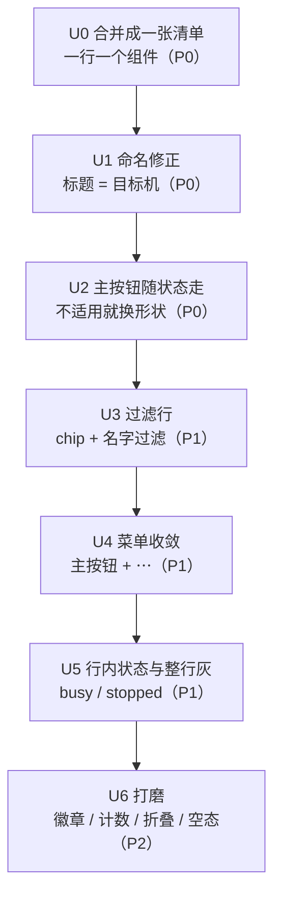

# 插件面板 UI 改进计划（PLUGIN_UI_PLAN.md）

本文件只谈**插件标签页长什么样**：从"四块并列"（目标机 / 安装状态 / 本机所持 / 市场）
改成"一个入口 + 一张列表 + 一行一个组件"。

边界：**安装层一行代码都不动**。契约仍是 `COMPONENTS.md`，阶段施工仍在 `PLUGIN_PLAN.md`，
五个冻结决定（§零之四，尤其"命令式不共享状态"与"页面没有任何远端清单缓存"）与 I1–I5
逐条继续成立。本文件的每一步都必须在它们之下成立，凡是与它们冲突的想法一律写在第六节"不做的事"。

## 零、这一轮读的源码

取自 `microsoft/vscode` 的 `main` 分支，路径均在
`src/vs/workbench/contrib/extensions/`（外加一处 server 端）。这几个文件是这一版
Extensions 视图的全部形状来源：

| 文件 | 它在 VS Code 里管什么 | 我们对照的是 |
| --- | --- | --- |
| `browser/extensions.contribution.ts` | 视图容器注册（`:115-130`）、搜索框里的"Filter Extensions..."子菜单（`:1066-1078`）与 11 个过滤入口（`:1094-1283`） | 我们的"过滤行"该有哪些项 |
| `browser/extensionsViewlet.ts` | 容器本身：视图注册表（`:99-521`）、搜索框（`:623-672`）、`doSearch()` 把输入翻译成一组 context key 决定谁可见（`:893-922`） | 面板的页头与"谁在什么时候显示" |
| `browser/extensionsViews.ts` | 一个视图 = 一条默认查询（`:1296-1330`）、查询语言（`:1165-1217`）、本地过滤（`:368-416`）、视图的消息框（`:188-209`、`:362`） | 列表、过滤、空/失败态 |
| `browser/extensionsList.ts` | 一行的模板（`:70-159`）与行级状态类（`:185-191`） | 行里放什么 |
| `browser/extensionsActions.ts` | 主按钮的状态机（`InstallAction` `:432-500`）、远端安装（`:732-889`）、"…"菜单（`ManageExtensionAction` `:1338-1417`）、"Install Specific Version..."（`:1580-1652`） | 每行的动作 |
| `browser/extensionsWidgets.ts` | 远端徽章（`:484-518`）、Workspace/Local 指示（`:596-672`） | 目标机身份怎么画 |
| `browser/extensionsViewer.ts` | `ExtensionsList`：单击一行 → 打开详情编辑器（`:52-140`，`openOnSingleClick: true`、`:112-127`） | 列表与详情分离 |
| `common/extensions.ts` | `ExtensionState`（`:48-53`）与 `IExtension` 的字段（`state`/`outdated`/`enablementState`/`runtimeState`） | 一行要表达的状态 |

（远端机器自己管扩展这件事，`PLUGIN_PLAN.md` §零之四.5 引的
`src/vs/server/node/serverServices.ts:403-409` 已经在 G1/G2 里落过地，本文件不重复。）

## 一、VS Code 的七条设计事实

### 1. 只有**一个**入口，没有"板块"

整个扩展界面是**一个视图容器**（`extensions.contribution.ts:115-130`，侧边栏一个图标、
`Ctrl+Shift+X`），容器里注册了二十来个 view，但**它们不是并列展示的**——每个 view 都带
`when:` 条件，由搜索框里的字符串决定谁出现（`extensionsViewlet.ts:893-922` 把输入翻译成
`searchInstalledExtensions` / `searchEnabledExtensions` / `searchOutdatedExtensions`… 一堆
context key，`:99-521` 的每个 view 各自声明条件）。输入框为空时显示"默认视图"（Installed /
Popular / Recommended），有输入时默认视图整批让位给搜索视图。

这就是"简洁"的第一个来源：**用户看到的是"当前这一个问题"的答案**，不是一个机房里所有仪表盘。

### 2. 一个视图 = 一条默认查询，不是一个页面

`DefaultPopularExtensionsView`、`ServerInstalledExtensionsView`、`EnabledExtensionsView`、
`DisabledExtensionsView` 全都只有十来行：override `show()`，把默认查询设成
`@popular` / `@installed` / `@enabled` / `@disabled`（`extensionsViews.ts:1296-1330`）。
筛出哪些扩展、怎么排序，全在同一个 `filterLocal()`（`:368-416`）。

推论：**"分区"是过滤器的一种说法，不是布局**。多一个分区 ≈ 多一条查询，不需要多一块 UI。

### 3. 多台机器 = 标题前缀，不是并列的区

`extensionsViewlet.ts:187-189`：

```ts
const getViewName = (viewTitle: string, server) =>
	servers.length > 1 ? `${server.label} - ${viewTitle}` : viewTitle;
```

需要并列时（本机 + 远端同时有扩展管理），"Installed" 视图**每台服务器一个**，标题里带机器名
（`:197-216`），并且此时不允许隐藏；只有一台服务器时反过来，Enabled/Disabled 视图
`hideByDefault: true`（`:290-321`）——默认折叠，因为它们平时没什么可看的。

远端身份在行上则是**一枚徽章**：`RemoteBadgeWidget`（`extensionsWidgets.ts:484-518`）只在
"这个扩展装在那台远端服务器上、且两端都存在"时才挂上去，tooltip 是
`Extension in {0}`。**没有第二块面板在讲远端。**

### 4. 一行 = 一枚主按钮 + 一个"…"菜单

一行的模板（`extensionsList.ts:70-159`）：图标（+ 三枚可选角标）→ 名字 → 行内状态位
（restart required / install count / rating / sync-ignored / kind）→ 描述一行 → 发布者 →
**动作条**。动作条里塞了十几个 action（`:116-129`），但它们**按状态各自显隐**，任何时刻
一行上真正看得见的是：

* 一个**主按钮**：`Install`（未装）、`Install in {远端}`（装了、可以装到远端，
  `extensionsActions.ts:840-857`）、`Install Locally`（`:859-871`）、`Update`（可更新）、
  `Installing…`（在飞，`:718-730`）；
* 一个 **"…"**（`ManageExtensionAction`，`:1338-1417`），菜单分组固定：
  启用（全局/工作区）→ 禁用 → 更新 → **Install Specific Version…** → **Uninstall**。

要点是 `InstallAction.computeAndUpdateEnablement()`（`:472-500`）：不适用时它
`hidden = true`，**是"不画"，不是"画成灰的"**；只有"这动作现在真能用/真不能用"才用 disabled。

### 5. 状态不是区块，是同一行的标签与类

* `ExtensionState`（`common/extensions.ts:48-53`）：Uninstalled / Installing / Installed /
  Uninstalling——**状态属于那一行**。
* 停用的扩展：整行加 `.disabled` 类变灰（`extensionsList.ts:185-191`），同时可以被
  `@enabled` / `@disabled` 两条查询分别列出；弃用的加 `.deprecated`。
* 结果与失败不进页面主体：`onError` 弹通知（`extensionsViewlet.ts:993-1014`，连
  `ECONNREFUSED` 都给一句"去看看 http.proxy"），安装失败的细节挂在那一行/那个弹出的详情页上。

### 6. 读失败是**视图的消息**，不是空清单

每个视图都有 `messageContainer / messageSeverityIcon / messageBox`（`extensionsViews.ts:188-209`），
查询回来的 `{text, severity}` 画在那里（`:362`），`showEmptyModel()`（`:284-288`）表示
"这条查询本来就没有东西"。两者的区别就是这么表达的——和我们的"读失败是数据"是同一条纪律，
只是它有固定的落点。

### 7. 列表永远不膨胀：详情去编辑器

`extensionsViewer.ts:112-127`：单击一行 → `extensionsWorkbenchService.open(extension)`，在
**编辑器**里开一个扩展详情页（Readme / Features / Changelog 标签）。列表里永远只有
"名字 + 一句描述 + 一行状态 + 两个控件"。

### 小结：VS Code 的简洁 = 五个"一个"

一个入口（搜索框）、一族过滤器（视图）、一行一个对象、一行一个主按钮 + 一个菜单、
一份详情在别处。我们的四块并列，恰好每一对都在"两个"上出错。

## 二、改造前的形状（0.1.32 之前）

四块并列已在 §七 U0 合成一张清单。本节保留原样，因为下面那张代价表就是 U-1–U-3 的依据；
里面的行号是**当时的**形状，`plugHeldSection` / `plugMarketSection` 今天已不存在。

`ui/index.html:76-87` 定了容器，`ui/js/components-panel.js` 填它：

```
plug-head   ："target machine" + 名字 + ↻                    （第 1 块）
plug-base   ：一行 supervisor URL
plug-note   ：在飞的写 / 上一次裁定 / 读失败 / "reading…"      （第 2 块）
plug-body
  ├─ plugHeldSection  "On this machine (n)"                  （第 3 块，:153-184）
  └─ plugMarketSection "Market (n of m source(s))"           （第 4 块，:677-712）
```

对照着看，代价是七条，按"用户会真的撞上"排序：

| # | 今天 | 代价 |
| --- | --- | --- |
| 1 | 同一个组件在"所持"与"市场"各占一行（`:162-183` 与 `:685-691`），装没装要靠用户把两行对起来 | 用户要自己拼安装状态；同一事实两处画，两处都可能过期 |
| 2 | 目标是 SSH 主机时，标题仍写 `On this machine`（`:183`） | **这一条就是"远程主机/本地主机"被看成两个板块的根源**：页头说是远端，下面的分区说是"这台机器" |
| 3 | 安装进度、宿主裁定、读失败全塞在 `plug-note` 一行（`:718-741`） | 状态与它描述的那一行没有视觉联系，而且下一次读会把它冲掉 |
| 4 | 每行最多四个按钮：`Versions` / `Disable` / `Remove` / `Install`（`:179`、`:690`） | 窄屏（手机）挤成一排，主次不分：最贵的动作（Remove）和最便宜的动作（Versions）一样显眼 |
| 5 | digest、source URL、"release under it"、路径全铺在行里（`:130-151`、`:295-331`） | 行高是给机器看的，不是给人看的 |
| 6 | 来源读不到时在"市场"节里追加若干 `<p class="plug-source-error">`（`:704-710`） | 报错成了清单的一部分，越长越像"内容" |
| 7 | 没有过滤：4 条以上就只能人眼扫（今天真机 4 条，已是临界） | 装到十条就不可用了 |

另外两处小账：`Market (n of m source(s))` 这个 `n of m` 说的是"来源数"，不是"可装数"；
`sources` 只在构造这句时用过（`ui/components-view.js:104-115`）。

## 二之二、一条不变量：面板恒为单机，一个组件一条记录

这一节把"为什么不可能出现近/远两行"钉在代码上——它是 U-1 的前提，也是 U-2 与 U-8 的尺度。

### 事实（我们的架构）

* **一次会话只有一个后端。** 组件长在 **supervisor** 那台机器上，而页面问的是哪一台，
  由 `ui/components-view.js:49-57` 的 `target(win)` 一处决定：它返回**一个** `{kind, base}`——
  会话在隧道对端就是对端，否则就是本机。`list()`（`:68-82`）拿这一个 base 去
  `hostInventory`，交回的就是**这一台机器**的名册。**没有任何一条代码路径把两台机器的名册并起来。**
* **组件落在哪台机器，由"会话的目标机"决定，不是组件天生的属性。** `clutch-workspace`
  在本机会话里装本机、在隧道会话里装对端——同一个组件、两种机器，但**一次只可能落在其一**，
  因为它永远是"被问的那台机器自己的表"（`agent/tools/rendezvous.py:25-27`：宿主只运行装在
  **它自己**机器上的组件）。
* 所以对一个前后端组合，某组件在这台目标机上**"有或没有"是唯一的一个答案**：不存在
  "同一个组件被这个面板同时看见两份"的场景，也就不需要为同一个组件画两个条目。

### 结论（对本计划的约束）

1. **一张清单，一个组件一行**（U-1 由"可以"升级为"唯一正确"）。
2. **机器身份只住页头**（U-2）：行里每一行都属于页头点名的同一台机器，行内不需要
   "哪台机器"这一列，也不需要默认挂远端角标。
3. 现有测试"定位到某一行"的方式（`tests/components-panel.test.js`）只认
   `plug-row` / `plug-name`，与机器无关——U0 合并后语义反而更直白。

### VS Code 对照：结论一样，理由不同（一个必须说清的差别）

"某个插件固定装在某侧"这个直觉，在 VS Code 里其实是 `extensionKind`（`ui` / `workspace` /
`web`）：扩展**声明**它想在哪跑，`remote.extensionKind` 还能逐条覆盖。但 VS Code 比我们**更宽松**：
本机与远端扩展宿主在一个窗口里**同时存在**，同一个扩展**可以两边都装**——这正是
`Install in {remote}` / `Install Locally` 两个动作存在的原因（`extensionsActions.ts:840-871`，
`RemoteInstallAction` / `LocalInstallAction`），行状态里因此会出现 "Please reload to enable
this extension in {remote}"（`extensionsActions.ts:2961-2969`）。

**即便这样，VS Code 也从不画两行。** 证据在 `ExtensionsWorkbenchService`：

* `installed` 把**每台服务器**的本机清单首尾相接（可能含重复），`:1395-1405`；
* 但列表读的是 `get local()`（`:1379-1392`）：它 `groupByExtension(...)` 按 identifier 分组，
  每组只 `push(getPrimaryExtension(组))`——**一个 identifier 一行**；
* `getPrimaryExtension()`（`:1902-2004`）是"谁入选"的规则：可用的压过停用的；都可用时由
  `extensionKind` 决定（`ui`→本机那份、`workspace`→远端那份、`web`→web 那份），再退到
  "本机 workspace / 本机 web / 远端 web"，最后 `extensions[0]` 兜底；
* 入选的那一行再把本机/远端说成**行上的事实**：一枚 `RemoteBadgeWidget` 角标
  （`extensionsWidgets.ts:484-518`，只在入选者的 `server === 远端` 时出现）、主按钮的标签、
  一条状态警告——**不是第二个板块**；
* 市场侧同样去重：已装的扩展不再作为"可装"出现（`extensionsViews.ts:320-333`）：`:325`
  把已在本机结果里的 id 从 gallery 查询里滤掉——**这正是 U-1 要的"一行一件事"**。

VS Code 唯一会把同一扩展放到两个标题下的地方，是**多服务器时的"每台服务器一个 Installed
视图"**：`extensionsViews.ts:348` 在视图显式带 `server` 时改用**未去重**的
`installed.filter(e => e.server === 该服务器)`，视图标题由 `extensionsViewlet.ts:187-189`
加上机器名——但那是**两个视图、一次显一个**，不是一张清单里的两行。我们的会话只有一个
目标机，这个分支在我们这里不存在。

### 唯一要留的余地

`runs_on: "other"` 是**预留**（`COMPONENTS.md` 声明示例里 `"runs_on": "self"` 那行的注释；`rendezvous.py:19-23`）：将来若出现
"服务另一台机器文件系统"或"被另一个宿主反向调用的客户端组件"，设计意图是**往表里加一条
entry，而不是给工具加一个分支**——每台机器仍渲染自己的那张表，单机视角不变。真到
"同一名字在目标机与客户端各有一份"的那天，答案仍旧是 VS Code 那一条：**一行 + 一枚角标**，
不新开板块。U-8 的角标因此保留为那个未来的位置，今天不默认挂上。

## 三、改进点清单

优先级：**P0 = 用户这次的抱怨本身**；P1 = 让列表在十条以上仍可用；P2 = 打磨。
"动通道？"一列都是 **否**：`ui/components-view.js` 今天给的
`target/list/market/install/versions/remove/setDisabled` 已经足够（`:49/:68/:118/:141/:244/:262/:285`），
下面每一条都只改 `ui/js/components-panel.js` + `ui/style.css`（+ `ui/mobile.css`）。

| # | 优先级 | 改什么 | 依据 |
| --- | --- | --- | --- |
| U-1 | P0 | **一张清单**：`held` 与 `market` 先合成"一个组件一条记录"，再渲染。行状态：`未装` / `已装` / `已装 · 可更新` / `已停用` / `本机有、市场不认识` / `市场有、本机没有` | `extensionsViews.ts:1296-1330`（视图=查询）、`extensions.contribution.ts` 里 Popular/Installed 都是"扩展一行" |
| U-2 | P0 | **命名修正**：所持分区的标题不再写 `On this machine`，而写**目标机名**（`plugTargetName()` `:60-71` 已有的那个名字），页头与列表说的是同一台机器 | `extensionsViewlet.ts:187-189` |
| U-3 | P0 | **主按钮跟状态走**：`Install` / `Reinstall`（已有逻辑 `:364-393`）、`Disable`（已装且在跑）、`Enable`（已停用）；不适用时**换形状或收进菜单，不再画一排灰按钮** | `extensionsActions.ts:472-500`（不适用即 hidden）、`:1424-1432` |
| U-4 | P1 | **过滤行**：`All / Installed / Market / Updates / Stopped` 五个 chip + 一个按名字过滤的输入框；默认 `All` | `extensionsViewlet.ts:893-922`、`extensions.contribution.ts:1189-1283` 的 11 个过滤入口 |
| U-5 | P1 | **"…"菜单**收纳次级动作：`Versions`、`Remove`（整个/单版）、`Reinstall`… 一行只剩主按钮 + `…` | `extensionsList.ts:116-129`、`extensionsActions.ts:1338-1417` |
| U-6 | P1 | **安装状态回到它那一行**：`plugState.busy.name === item.name` 时该行加 `.busy` 并在行内画 `plugStageLine()`（`:399-427`）；`plug-note` 只留全局故障与"读失败" | `InstallingLabelAction`（`:718-730`）、视图消息框（`extensionsViews.ts:188-209`） |
| U-7 | P1 | **停止 = 整行变灰**（`.plug-row.stopped`），`stopped` chip 保留作说明 | `extensionsList.ts:185-191` |
| U-8 | P2 | **目标机身份**：页头压成一行"作用于 <名字> · <base>"；机器只住页头，行内**不**加"哪台机器"列。远端角标留作 `runs_on=other` 出现时的位置（§二之二末），今天不默认挂 | `extensionsViewlet.ts:187-189`（标题前缀）、`extensionsWidgets.ts:484-518` |
| U-9 | P2 | **计数**：过滤 chip 各自带计数（`Installed 3`、`Updates 1`）。Tab 徽章**决定不做**（理由见 §七） | `extensionsViews.ts:179-186`（CountBadge）、`extensionsViewlet.ts:1026-1074`（activity bar 徽章） |
| U-10 | P2 | **次级信息折叠**：digest / source / release-under-it / 路径进 `title=` 与 `Versions` 展开区；市场那段常驻警告（`:697-701`）改成 hover | `extensionsList.ts:88`（描述一行省略）、`:70-159` 行内不放元数据 |
| U-11 | P2 | **来源失败的落点**：一处（列表顶/尾）的 `plug-source-error` 汇总行，而不是散在清单里 | `extensionsViews.ts:362` |
| U-12 | P2 | **空态**：一条查询零结果是"这条过滤没有东西"（可读句），读失败仍是失败句——两句不能长得一样 | `extensionsViews.ts:284-288` vs `:362` |

### 我们**不抄**的三件事（写下来免得日后返工）

1. **查询语言**：VS Code 让用户看见 `@installed` / `@enabled` 这种语法（`:1199-1217`）。
   我们只有六个动词、四个来源，chip 过滤即可；`@` 语法是我们的内部词汇，不进 UI。
2. **每台机器一个视图**：VS Code 多服务器时并列视图是它的一等公民（`:197-216`）。
   我们的页面对应**唯一一台目标机**（§零之四.1），页头点名它，列表不再分机器。
3. **详情编辑器**：我们没有编辑器容器，`Versions` 展开区就是我们的详情位（零之四.3 也要求
   这个展开区是"读回来的机器自己的答案"，不是我们存的一份）。

## 四、施工顺序

每步都独立可发布、独立可回滚；每一步的验收都是**先跑绿现有测试，再加新断言**。



每步做什么（一行一件；施工细节与偏离全在 §七）：

| 步 | 做什么 |
| --- | --- |
| U0 | `plugModel()` 按 name 把 `held` 与 `market.entries` 合成一条记录，`renderPlugins()` 只画一个列表；`plugSection()` 保留但退化成"视图标题 + 计数"。市场侧独有的 `interface/origin/version` 与所持侧独有的 `digest/disabled/path` 都进同一行的 chips，**没有任何信息丢失** |
| U1 | 分区标题换成目标机名；列表顶部只留一行"这台机器：<名字> · <url>"；`Market (n of m source(s))` 改成由 U0 模型统计的条数 |
| U2 | 主按钮随状态走（`Install` / `Reinstall` / `Enable` / `Disable`），`Remove` 与 `Versions` 收进 `…` 菜单；菜单化只改**入口位置**，不改确认文案（I5 不变） |
| U3 | 新过滤行 `#plug-filter`（五个 chip + 名字框，默认 `All`）；在渲染期过滤，**不落盘、不发请求**（零之四.3：过滤是"看"的一种，不是"存"的一种）。`Updates` = 已装且市场版本不同 |
| U4 | 不依赖框架的 `plugMenu()`：主按钮右侧的绝对定位列表，失去焦点即关；项就是现有 handler，一个都不新写；手机上补齐触摸目标 |
| U5 | busy / result 落到**它那一行**，`plug-note` 只剩读失败 / 通道缺失 / 全局故障；停用整行灰（`.plug-row.stopped`） |
| U6 | 打磨：chip 计数（U-9 前半）、空态与失败态分句（U-12）、`Versions` 展开区缩进；**决定不做** Tab 徽章；U-10 折叠、U-11 汇总、U-8 远端角标留到 §八 及以后 |

## 五、验收与护栏

* **面板自己的测试**：`node tests/components-panel.test.js`（35 组，见 §九 9.5）是这次改造的
  唯一硬约束。它的 mini-DOM 按 `plug-row` / `plug-name` 定位（`tests/components-panel.test.js`
  的 `rowOf()` / `rowNamed()` / `stateOf()`），
  所以 U0 起手就要**保住 `.plug-row` 与 `.plug-name` 这两个类名**（行首是名字），
  其余类名可以随布局改。定位方式的变化集中在 `rowOf()` / `ownerName()` / `stateOf()` 三处
  （`.plug-row` 现用正则 `/(^| )plug-row( |$)/` 匹配整词，因为行也会带状态类
  `.stopped` / `.busy`），断言里的**事实**（哪台机器、什么代价、宿主裁定原文）一条都不许放松。
* 新增断言（U1–U2 就要加）：过滤行只改可见性不改数据；`Updates` 只列出"已装且市场版本不同"的；
  `…` 菜单里的 `Remove` 与今天一样先问；`Disable` 依然不问。
* **通道测试不动**：`tests/components-view.test.js`、`tests/components.test.js`、
  `tests/bridge-server.test.js` 第 9 节（手机宿主）应全程保持绿——如果它们红了，
  说明改动越界到了通道。
* **手机资产**：`android/app/src/main/assets/ui/` 是 `ui/` 的拷贝，改完跑
  `scripts/sync-android-host.sh`，再跑 `node tests/android-assets.test.js`。
* **字体验证**（发布前的 deb 前置守卫）：新增的 UI 文本保持英文；**不要往 `ui/` 的注释里写
  `§`**（v0.1.30 第一次打 tag 就栽在这），改完跑 `.venv/bin/python -m tests.ui_fonts_check`。
* **无障碍契约（§九 起由测试钉住）**：行的事实由控件行末尾**恰一个** sr-only 节点承载，行里每个控件
  用 `aria-describedby` 指向它（含菜单项）；`.active` / `.open` / `.busy` 表达的状态同时要有
  `aria-pressed` / `aria-expanded` / `aria-busy`；`drawnText()` 仍要求行里除了名字与一句话什么都不画
  （sr-only 不算"画出来"）。改面板时这三条不许破。
* **端到端手测**（沿用 P2 的配方）：一次性 supervisor（`CLUTCH_COMPONENTS_DIR=/tmp/… --port 8899`），
  真面板指过去，走一遍 装 → 再装（current）→ 停用 → 启用 → 单版卸载 → 全部卸载；
  本机 8890 全程不动。

## 六、明确不做的事

1. **不给面板加通道 / 端点**：过滤、合并、菜单全是渲染期的事（U-1/U-3/U-4 都不碰
   `window.clutchComponents`）。这条守住了，UI 改造就永远不会动到宿主契约。
2. **不引入"可更新/可回滚"这类新语义**：`Updates` 只是"市场报的版本与所持版本不同"这一条
   事实的说法；§一 的"没有回滚"原样成立。
3. **不把市场常驻警告搬进 `title=` 时削弱它**：`Remove` 的确认框（`:490-497`）与单版确认
   （`:528-536`）是 I5 的落点，菜单化只能挪入口，不能删句子。
4. **不抄 `@` 查询语法、不抄多服务器并列视图、不抄编辑器详情页**（第三节末三条）。
5. **不动 P4/P5/G4**。这次是纯外观工程，与工具集契约无关；U 系列做完之后，P4 的行号锚点
   会漂（`ui/js/components-panel.js` 会大改），届时按 PLUGIN_PLAN §三 P4 的清单重新对一次即可。

## 七、落地记录（U0–U6）

按 §四 的顺序实施，每一步都先跑绿现有测试再加新断言。通道（`ui/components-view.js`）与
安装层（P4/P5/G4、supervisor 端点）**全程未动**：过滤 / 合并 / 菜单 / 状态行都是渲染期的事。

* **U0 一张清单**：`plugModel()` 按 name 把 `plugState.market.entries` 与 `plugState.held` 合成一条记录，
  `plugItemChips()` / `plugItemLines()` 从合并后的记录推 chips 与说明行；已删 `plugMarketLines()` /
  `plugHeldSection()` / `plugMarketSection()`，`plugSection()` 退化成"视图标题 + 计数"。槽位顺序：
  先市场顺序，再合并只有机器持有的组件。
* **U1 命名修正**：列表标题 = 目标机名（`plugTargetName`），计数降进 `.plug-meta`（mono、小号、
  不随标题大写）。
* **U2 主按钮随状态走**：`plugPrimaryButton(item)`（`entry` → `Install`/`Reinstall`，否则 `held` →
  `Enable`/`Disable`）+ `plugItemMenuItems(item)`（`entry && held` → 菜单里的 switch；`held` →
  `Versions` + `Remove`）。
* **U3 过滤行**：`ui/index.html` 在 `plug-note` 与 `plug-body` 之间加 `div#plug-filter.plug-filter`；
  五个视图 `PLUG_FILTERS` = `all` / `installed` / `market` / `updates` / `stopped`；
  `plugState.filter` / `plugState.query` 只活在内存（不落盘、不发请求）。`plugFilterRow()` **只建一次**
  （重建会把输入框的 caret 抢走），`plugDrawFilter()` 只重画状态类与计数；`plugItemShown(item)` =
  名字 query 命中 **且** `plugItemMatches(item, filter)`。
* **U4 菜单收敛**：`plugMenu(items)` / `plugMoreButton(name, menu)` / `plugCloseMenus()`，范式照
  `ui/js/settings.js` 的下拉（按钮 `stopPropagation` + document click 收起）。菜单项**常驻 DOM**，
  只由 `.open` 决定可见——所以 `switches()` / `removes()` / `versionBtns()` 的计数断言全部照旧
  （"一个只在该出现时才被建出来的控件，是页面没法被问到、也没法被 `title` 的控件"）。
  手机（`ui/mobile.css`）：`…` 与菜单项补 7px/12px 的手指目标。
* **U5 行内状态与整行灰**：`plugItemState(item)` → `{text, cls, row}`，`plugRow(...)` 在行头之后插
  `div.plug-line.plug-state`；写操作的 stage 与宿主裁定画在该组件**自己的行**上，`plug-note` 只剩
  读失败 / 孤儿写 / `reading…`。`plugOrphanLine()` 兜底：写操作的行不在屏幕上（被卸载掉、被过滤
  隐藏）时把 stage / 裁定落回 note——"起了一次写却对它闭口的页面，是丢掉一次删除的页面"。
  三个 result 工厂（`plugInstallResult` / `plugRemoveResult` / `plugSwitchResult`）都带 `name`。
* **U6 打磨**：`plugItemMatches(item, filter)` 给"过滤"与"计数"共用，`plugDrawFilter()` 用
  `plugModel()` 算**不受名字 query 影响**的计数（chip 的数字是那个视图里有多少，不是名字框此刻
  拼出了多少），0 不画；`plugEmptyText(known, shown)` 把"没读完 / 读失败 / 过滤没命中 / 机器真的是空"
  分成不同句子，`plug-meta` 补 `market unreadable`（与 `inventory unreadable` 对称）；`Versions`
  展开区缩进成嵌套列表（`.plug-versions-box` 左侧一条 border），`.plug-versions.open` 亮起。

两处**偏离计划**——都不是失手，是改成了更对的：

* **偏离计划一**：`Reinstall` **永远留主按钮**，不收进菜单。市场条目本身的用途就是"把它放上这台
  机器"，已装同版时"再装一次"仍是它的主操作；进菜单会变成"要点开菜单才知道还能不能再装"。
  比较按**种类**而不是节点身份（早先误写成对象身份比较，菜单里多出一个 switch，测试 17 当场抓到）。
* **偏离计划二**：保留可见的说明句 `held on this machine, but not driven: its tools are not offered
  here`，**不**降进 `title=`——这是"held ≠ driven"唯一的可见解释，也保住了测试 17 的事实断言。
  整行灰因此是 `.plug-row.stopped`（不驱动）与 `.plug-row.busy`（写飞行中，stage 行保持全重）。

**I5 不变**：`Remove` 先问、问句里点名版本与机器、说 `nothing here keeps a copy`；`Disable` 不问。

### U-9 的 Tab 徽章：决定不做

插件面板的数据**只在打开标签页时才读**（`settings-tab-plugins` 的点击 → `pluginTabShown()` → `plugRead()`）。
给 tab 画"有可更新"的徽章，就意味着在用户开口之前就去读机器与市场——这与"面板的数据模型是打开时才有的"
这一条直接冲突。计数留在 chip 上，那里是数据已经读过之后的地方。

### 测试与护栏

* 面板套件随重构增组：定位方式改成正则与 `rowNamed()` / `stateOf()`，断言的事实一条没放松；
  U5 加孤儿兜底、U6 加 chip 计数。收尾全绿：`components-panel` / `components-view` /
  `components` / `bridge-server` 四个 node 测试、`.venv/bin/python -m tests.ui_fonts_check`、
  `scripts/sync-android-host.sh` + `node tests/android-assets.test.js`。

### 仍未做

* U-10 次级信息折叠 → **0.1.33 已做，见 §八 8.2**；U-11 来源失败汇总、U-8 远端角标（等 `runs_on=other` 真的出现再挂）。

## 八、0.1.33：按 VS Code 的实现回改（用户验收意见五条）

v0.1.32 的成品被用户判为"极其不专业"并逐条指出。这一轮**先把 VS Code 源码拉下来**（落盘临时目录
`.vsc-ref/`：`extensionsList.ts` / `extensionsActions.ts` / `extension.css` / `extensionsWidgets.ts` 等，
用完即删），再按**实现**回改，不按"精神"猜。

### 8.1 已安装的行不再有 Install（用户第 1 条）

* 依据：`extensionsActions.ts:472-500` `InstallAction.computeAndUpdateEnablement()` 开头
  `this.hidden = true`，且 `if (this.extension.state !== ExtensionState.Uninstalled) return;`——
  安装后 Install 是**不画**，不是画灰；启用/禁用从来不在行里内联，而在 `ManageExtensionAction`
  （`:1338`，齿轮 + 下拉：Enable(全局/工作区) → Disable → Update → Install Specific Version… →
  Uninstall）；有更新时行的主操作是 `UpdateAction`（`:957`，label `Update` `:971`）。
* 落地：`plugItemLead(item)`（`entry && !held` → install；`held && entry && 有更新` → update；否则
  switch）决定行主按钮，标签 **Install / Update / Reinstall**（已装且 release 不同 = Update，title
  说清被替换的版本不会被留）；次级动作按 `plugItemMenuItems(item, lead)` 全进 `…` 菜单。
* **回退"偏离计划一"（§七 U2）**：`Reinstall` 不再永远占主位——用户要的就是 VS Code 的行为：已装的
  行主位是启用/禁用（有更新时 Update），"再装一次"是菜单里的次级动作。

### 8.2 行只留"标题 + 一句话"（用户第 2 条）

* 依据：`extensionsList.ts:70-90` 的 `renderTemplate` = `.icon-container`(36px) + `.name` +
  `.description.ellipsis` + `.footer`，样式在 `media/extension.css`（`.name` 半粗 nowrap ellipsis、
  `.description` 用 `--vscode-descriptionForeground`、`.ellipsis` 三件套）。行里没有版本号、没有
  digest、没有路径。
* 落地（即 **U-10 次级信息折叠**，§七"仍未做"里那条）：`plugItemChips()` 只留 `stopped`，行内版本
  chip / interface chip / origin chip / "not offered by this client" 全部撤销；`plugItemDesc(item)`
  出一句话；digest / 源路径 / offered 版本 / release / interface 全部搬进 `plugItemMeta(item)`，
  拼成行的 `title=`。CSS 补 `.plug-row-desc`（单行 + ellipsis + muted）与
  `.plug-row-head .plug-name`（nowrap + ellipsis）。
* 数据前提（已核实）：发布清单 `clutch-component.json` 只有
  `schema/name/interface/version/declaration/artifacts`，**没有 description**（`ui/components.js`
  的 `parseManifest()` 只按 checkout 的 `declaration` 取 `ui.label`），所以行里那句"简介"只能是
  **按状态推导**的一句，不能凭空造组件简介。

### 8.3 面板不再顶满整屏（用户第 3 条）

* 依据：VS Code 的列表是一个**有底的滚动区**（`extensionsList.ts:29` `EXTENSION_LIST_ELEMENT_HEIGHT = 72`，
  虚拟化列表），不是页面长度的柱。
* 落地：`#settings-modal .modal-box` 改 `display:flex; flex-direction:column; max-height:min(78vh, 720px);
  overflow:hidden`；`h3` / `.modal-tabs` / `.modal-actions` / `.plug-head` / `#plug-base` / `.plug-note` /
  `#plug-filter` 全部 `flex:none`；`#plug-body{flex:1 1 auto;min-height:0;overflow-y:auto}`（原
  `max-height:44vh` 撤掉）。`#settings-pane-plugins` 那条**必须写成 `:not(.hidden)`**：id 选择器会压过
  `.modal-pane.hidden{display:none}`。
  手机：`ui/mobile.css` 删掉 `.plug-body{max-height:none;overflow-y:visible}`（它正是"顶满整屏"的来源），
  并把 `#settings-modal .modal-box` 从"整框滚动"那组选择器里摘出来（它整框不滚，滚的是里面的列表），
  高度上限收到 `calc(100vh - 96px)`——手机上一整块贴边的框读起来像"第二页"，而这个面板是盖在正在读的
  那页上的：上下各留一段遮罩，剩下的高度给列表。

### 8.4 过滤 chip 高亮时白底白字（用户第 4 条）

* 根因：`button:hover:not(:disabled)`（`ui/style.css:266`，具体度 (0,2,1)）与
  `.plug-filter-chip:hover:not(:disabled)` ((0,3,0)) **压过** `.plug-filter-chip.active` ((0,2,0))；
  安卓 WebView 里点一下 `:hover` 会滞留，于是激活 chip 的 `--text` 背景 + 被改回 `--text` 的文字 =
  白底白字。
* 修法：`.plug-filter-chip.active` 连同它的 `:hover:not(:disabled)` / `:focus-visible` 三种状态写在
  同具体度且置于其后。同类隐患一并修：`.plug-switch.stopped:hover:not(:disabled)`（hover 会丢 accent）、
  `.modal-tab.active:hover:not(:disabled)`（hover 会把激活 tab 的 accent 下划线刷成灰）。

### 8.5 测试

* `tests/components-panel.test.js` 的断言随重构更新（**不放松事实**）：第 17 组的"版本 chip"改成"名字旁的
  stopped chip"（版本已按 8.2 撤出行）；第 31 组改问行**主按钮是哪一个**（新 helper `p.primary()` 读
  `.plug-row-actions` 的首个子节点），并补两个方向：held 落后 → 主按钮 `Update` 且 title 说清被替换的
  版本；held + entry 无更新 → 主按钮是 switch、菜单里是 `Reinstall`。断言里都写了 VS Code 出处，便于
  日后有人再"简化"前先看依据。

## 九、0.1.34：每一个事实都要能不带指针地读到

§八 8.2 把行里的版本 / digest / 源路径 / offered release 搬进了行的 `title=`，而 `title=` 只有
"鼠标停在行上"这一条到达路径：键盘与手机读得到名字、一句话和控件，读不到这行真正在讲的事实。
同一轮搬迁还留下三处只由 class 表达的状态——哪个 chip 是当前视图（`.active`）、哪个菜单开着
（`.open`）、哪个展开区摊开着（`.open`）——对看不见 class 变化的人，等于没说。这一轮把"画得出来"
与"说得清"对齐，**不新增任何画出来的字，不给任何控件加 tab stop**。

### 9.1 行的事实再写一遍（sr-only + `aria-describedby`）

* `plugFactsNode(text)`（`ui/js/components-panel.js:89`）建一个 `class="sr-only"`、
  `id="plug-row-facts-N"` 的节点（`plugIdSeq` `:88` 保证每个"要被指向"的节点都有自己的 id），挂在行的
  控件行 `.plug-row-actions` **最后一个子节点**上——所以没有任何控件因此换位置。`plugDescribeTree(el, id)`
  （`:100`）从控件行开始递归写 `aria-describedby`；**菜单项也要写**：它在本轮之前就已经建好
  （§七 U4 的"常驻 DOM"），一个"后建"的描述等于没有。
* 节点是**裁切**（`.sr-only`，`ui/style.css:1632`）而不是 `display: none`：无障碍树留得住它，控件不多
  一个 tab stop，`title=` 原地不动。两处服务两种人（悬停的 / 读屏的），不是同一句话的两种画法：sr-only
  节点写的**就是** `plugItemMeta()` 拼的那句 `title=`（§八 8.2）——一句话，两个出口，不会各自漂。

### 9.2 class 单独扛着的状态改成 ARIA

| 事实 | 原来 | 现在 |
| --- | --- | --- |
| 五个过滤 chip 里当前那个 | `.active` | chips 盒子 `role="group"` + `aria-label`（`:316-317`），每个 chip `aria-pressed`（建时 `:324`、重画时 `:363`） |
| 行的 "…" 开着没有 | `.open` | `aria-label`（点名组件与机器）+ `aria-haspopup` + `aria-controls`（菜单自己的 id）+ `aria-expanded`（建时 `:520-523`、点击时 `:537`，`plugCloseMenus()` 兜底 `:571`） |
| Versions 展开区 | `.open` | `aria-expanded`（`:770`） |
| 正在写的那一行 | `.busy` | `aria-busy`（`:144`） |
| 设置弹窗的 tab | `.active` | `aria-selected`（`ui/js/settings.js:341`；`ui/index.html:67-70` 的 `role="tab"` + `aria-controls`） |
| 一个清单、一行一条、chips 是一组 | 无 | `role="list"`（`:224`）/ 每行 `role="listitem"`（`:586`）、chips `role="group"`（`:316`） |
| 面板与它的弹窗 | 无 | `role="tabpanel"` + `aria-labelledby`（`ui/index.html:72`、`:81`）、`role="dialog"` + `aria-modal` + `aria-labelledby`（`:58`） |
| 名字框 | 只有 `placeholder` | `aria-label`（`:346`）——placeholder 不是名字 |
| 重读按钮 ↻ | 只有 `title=` | `aria-label`（`ui/index.html:89`） |
| 面板的说明行 | 无 | `role="status"` + `aria-live="polite"`（`ui/index.html:95`），读失败与孤儿写要说出来 |

* Escape 由 **document** 收菜单（`:575-580`）：菜单挂在"开它的那个控件旁边"，不是一个自成一体的控件，
  Escape 在按钮上和在菜单里必须同一个意思。
* 五个"正在写"的控件不再只写一个裸 `…`：`plugBusyLabel()`（`:689-692`）给
  Installing… / Removing… / Stopping… / Starting… / Reading…，用的是**已有的省略号码位**——
  图标码位被 `ui/style.css:56-59` 与 `tests/ui_fonts_check.py` 双向锁着，一个字都不许新加。

### 9.3 `opacity` 换成量过的颜色

* 两种"退到后面去"的整行灰原来写的是 `opacity: .55` / `.62`。合成会把行里的分隔线、accent 标记
  和文字一起拖下去，文字只剩约 **2.5:1**——低于 4.5:1 的底线，而且规则线本身也是被"变淡"画的。
* 现在是颜色：`--muted` 与新增的 `--dim: #83838B`（`ui/style.css:76`，注释里写着它替代 opacity 的理由）。
  `--dim` 是**按行真正坐着的那层表面量的**：`.modal-box` 的 `--bg2 #161618` 上 4.81:1、页面
  `--bg #0F0F10` 上 5.09:1（先试的 `#7E7E86` 只有 4.49:1，差一点点不合格）。
* `.plug-row.stopped:hover` 回满重——停用只是"这台机器不驱动它"，指针指着它时不该还读起来像次要信息；
  危险色统一走 `--danger`（`:131`，`var(--accent)` 的另一个名字）。

### 9.4 同一轮的收尾

* **token 化**：插件块是整张表里唯一自带一套 4px 刻度、又在 `ui/mobile.css` 里把每个尺寸抄一遍的地方。
  现在写的是名字：`--s1..--s6`（`:115`）、`--ctl-h` / `--ctl-h-sm` / `--tap`（`:120-122`）、
  `--fs-xs..--fs-xl`（`:126`）、`--radius`（`:127`）、`--danger`（`:131`）；手机端只在
  `ui/mobile.css:197` 的 `#settings-pane-plugins` 上改这几个值。注释同时写明**旧规则仍带自己的 px**
  （本轮之前的注释声称全表都遵守刻度，实际不是）。
* **焦点环回归**：块里 4 处 `outline: none` 删掉，`:300` 的全局 `:focus-visible` 环重新照到这些控件。
* **表头不再被大写**：`.modal-box h4`（`:1031`）给所有 h4 加 `text-transform: uppercase`，于是机器名
  `SSH ubuntu@box` 读成 `SSH UBUNTU@BOX`——`.plug-section-title`（`:1195`）显式 `text-transform: none`：
  这是**数据**，不是标题。
* `#plug-reload` 的 `font-size` 改 `var(--fs-lg)`；`#plug-base` 加 `min-height: var(--fs-lg)`
  （与 `.plug-note` 同一守卫：读之前那里不许塌成一个 0 高度的洞）。

### 9.5 测试

* `tests/components-panel.test.js` 的 mini-DOM 补上属性 API（`setAttribute` / `getAttribute` /
  `removeAttribute` / `id` / `attrs`，`:65-70`）。断言的事实一条没放松：**35 组不变，+72 行**。
* 新增两个读数（`:106-121`）：`drawnText(n)` 跳过 `.sr-only` 子树 = "画出来的文本"；
  `describedBy(el, root)` 按 id 在**子树内**解析 `aria-describedby`（"从页面别处飘来的 id 不是描述"）。
  前者正是第 35 组"行里除了名字和一句话什么都没有"现在要问的对象——那句话现在也在树上，只是没被画出来。
* 第 35 组补：控件行**恰一个** sr-only 节点、内容等于行的 `title=`、位于控件行末子、类名恰是 `sr-only`、
  能在行子树内解析；第 31 组补 `…` 的 `aria-expanded` false → true → false 与
  `aria-controls` / `aria-haspopup` / `aria-label`；第 32 组补 chip 的 `aria-pressed` 恰一个 true
  且随视图移动、chips 的 `group` + `aria-label`、filter input 的 `aria-label`。
* 收尾全绿：`node tests/*test*.js` 全套，加 21 个离线 python 模块（`.venv/bin/python -m tests.<name>`）
  与 `scripts/sync-android-host.sh` + `node tests/android-assets.test.js`（手机资产与桌面同字节）。
  （`eval.harness` 要真 LLM，离线必然红，不算进"离线套件"。）

### 9.6 发布

* 宿主 0.1.34（轻量 tag `v0.1.34`）：`VERSION` + `ui/package.json` + `ui/package-lock.json` 三处 bump，
  `chore(release): 0.1.34`；CI（`.github/workflows/release.yml`，只在 `push tags: v*` 触发）出
  deb / dmg / win / apk 并挂到 release。
* 组件 `clutch-skills` 0.1.1：`component.json` + `pyproject.toml` + `clutch_skills/__init__.py` 三处一起
  bump（它自己的 release workflow 核对 tag 与 `component.json` 同名，不一致就拒绝发布）。宿主只持一个
  URL（`ui/components.sources.json` 的 `releases/latest`），所以这次宿主一行都没为它改。

### 仍未做（§六 之外新记的）

* 模态级 Escape 与焦点陷阱：`ui/js/settings.js` 的 Escape 只在 confirm 可见时响应，
  `ui/js/conn-lost.js:138` 自己吞掉 Escape；其余 7 个 modal 仍没有 `role="dialog"`。
  这一轮把设置弹窗与两个 pane 的语义补齐了，剩下的是"焦点该停在哪儿"这一整件事，另开一轮做。

## 十、0.1.36：行里两列，切页时高度跟着走（用户意见两条）

用户装出 0.1.35 后看的是两件事：**行内文字与按钮上下堆叠**——"文字右侧有较大空白，按钮左侧也有
较大空白"，要的是 VS Code 那种左右分布；**Model 与 Plugins 两个标签切换太生硬**，要的是文件浏览
界面那种"窗口高度的变化平滑动画"。两条都只动插件面板与设置弹窗的外形，安装层、契约与 §零之四的
冻结决定一条都不碰。

### 10.1 一行 = 两列（用户第 1 条）

* 症状的算法：行是块级流，`plug-row-head`（名字 + 状态标记）与控件行各自独占一行，于是**两行各比
  对方宽的那一条短**——短的那条右侧（文字）与另一条的左侧（按钮）各留一片空白，正是用户指出的两处。
* 依据仍是同一处行模板（`extensionsList.ts:70-159`）：名字与一句话是一列，行内动作区是同一水平线上
  的另一列，两列之间没有"谁占一行"这回事。
* 落地（`ui/js/components-panel.js` 的 `plugRow()`）：新增 `div.plug-row-main` 把 head / 状态行 /
  一句话 / 进度行包成**一列字**；控件行 `.plug-row-actions` 与版本盒仍是行的直接子节点，**顺序不变**
  （字在前、控件在后、版本盒最后），所以"`.plug-row-actions` 首子节点 = 主按钮"这条既有断言、
  `aria-describedby` 的书写顺序与 sr-only 节点的位置都不动。
* 落地（`ui/style.css`）：`.plug-row` 改成 `display:flex; flex-wrap:wrap; align-items:center;
  gap: var(--s2) var(--s3)`；`.plug-row-main{flex:1 1 0%;min-width:0}`——**按"剩下的宽度"分，不按
  句子长度分**：给字那一列 `flex-basis: auto`，长一点的句子照样把控件挤到下一行，那正是被替换掉的
  形状；`.plug-row-actions{flex:none;margin-left:auto}`——控件不参与收缩（会动的目标不是目标），
  并被钉在行的右缘，无论字那一列多长；版本盒 `flex:1 1 100%` 明确独占一行（它是行的第三个 flex
  子节点，不写这一条就要和上面两列抢宽度）。
* 手机：`ui/mobile.css` 里 `.plug-row-actions{flex:1 1 100%}` **恢复上下堆叠**——四个控件加起来约
  290px，而手机上内宽只有 288px，横排只会换行成两层半；手机上还原成改动前的形状，不算回归。

### 10.2 切页时弹窗的高度（用户第 2 条）

* 两个 pane 长短不同，而 `#settings-modal .modal-box` 只有"正在显示的那个 pane"那么高（§八 8.3 定下
  的形状），所以一次标签点击会**整框换高度**；换在一帧里发生，读起来像"来了第二个框"，而不是"我站的
  这个框重新长开"。
* 修法**不是** CSS transition，理由写在 `ui/js/settings.js` 的注释里，这里记一遍：
  1. 那个高度不属于任何单独元素——它是"当前 pane + 框自己的 chrome"，没有可过渡的属性宿主；
  2. **它在切换之后还在动**：插件 pane 由一个回答两次的读填（先机器、后市场），列表是切换**之后**
     才到的。transition 只能瞄准点击那一瞬间量到的高度，走完再看就跳一下；
  3. `height: auto` 与长度之间不可插值，而"中途第二次点击"要能改目标——rAF 每帧重设目标即可，一个
     跑着的 transition 只能被取消，表现为一顿。
* 落地：`SETTINGS_HEIGHT_MS = 300`（与文件浏览界面 `#fs-body` 的 `max-height .3s ease` 同长——同一类
  跳跃用同一种走法；注释与测试都钉住这个等式）；`settingsBoxWants()` 临时清空内联高度再读回自然高度
  （同一 task 内不绘制，框不会真的被画成那个高度）；`settingsHeightStop()` / `settingsHeightEase()`
  （`1-(1-p)³`，ease-out）/ `settingsHeightStep()`。`showSettingsTab()` 的顺序是刻意的：先读**此刻**的
  高度（可能正处在上一段动画中途，于是第二次点击从当前位置续上，而不是先弹回某个 pane 自己的高度）
  → 停上一段 → 锁住这个高度 → 切 pane 与类名 → **下一帧**才开始走（插件 pane 的 reading 态是同一
  task 里另一个监听画的，要去的那个高度得是它量出来的）→ 到位即把内联高度交还样式表，此后任何重排
  （列表补齐、拖窗口）都是一帧的事。
* 两条早退：`reducedMotion()`（样式表的 reduce 块只关 CSS 过渡与动画，管不到 rAF，必须显式判）与
  "量到的高度为 0"（弹窗还没打开就是 `display:none`，而 `openSettings()` 正是从这里切第一次 tab）。

### 10.3 测试

* 新增 `tests/settings-tabs-test.js`（node 套件 41 → 42）：把 `SETTINGS_TABS` 到 `showSettingsTab()`
  的**真代码**从页面自己声明的脚本清单里切出来，在 stub document 与假帧时钟上跑，问的都是"截图看不
  出"的事实：切换瞬间锁住旧高度、动画**下一帧**才起步、pane 在飞行中变长时框跟着长且从不回退、
  到达后高度交还样式表、第二次点击从当前高度续接、点同一枚 tab 不产生运动、未打开的弹窗与
  reduce-motion 都只切 pane 而不走高度。样式表侧在同一次跑里钉住四条：`.modal-box` 没有任何
  `transition`（CSS 不与这个逐帧高度抢）、框本身不滚（滚的是 pane，而框才是被量的那个）、
  `SETTINGS_HEIGHT_MS` 恰等于 `#fs-body` 的过渡时长、`ui/index.html` 的 tab / tabpanel 开屏时就已经
  彼此一致（切页只搬一个类 + 写 `aria-selected`，起点不一致等于开屏就说谎）。
* `tests/components-panel.test.js` 第 35 组随行结构更新（新 helper `mainOf()`；`nameOf()` 不再假设
  名字是行的首子节点——版本盒是本行最后一个子节点，遍历顺序保证先拿到本行的名字），并补了**样式表
  侧**的四条：行是一条 wrap 的 flex 线、字那一列按剩余宽度分且可截断、控件那一列不缩且贴右、手机上
  重新堆叠。
* 收尾全绿：42 个 node 测试 + 21 个离线 python 模块（`.venv/bin/python -m tests.<name>`），以及
  `scripts/sync-android-host.sh` 后的 `node tests/android-assets.test.js`（手机资产与桌面同字节；
  `android/app/src/main/assets/` 是生成物，不入库）。
