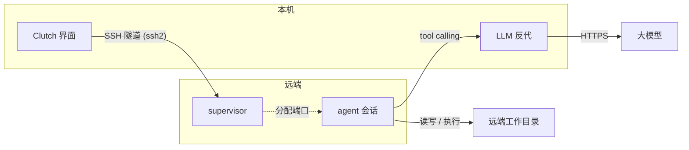
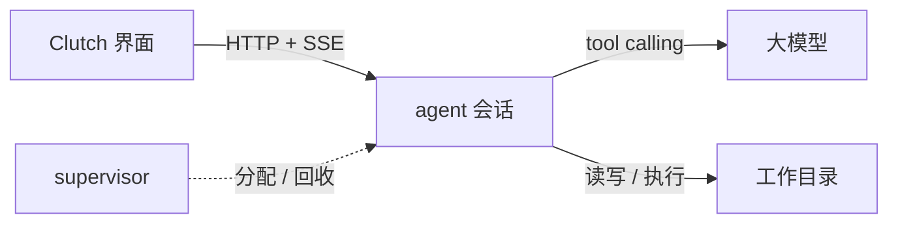
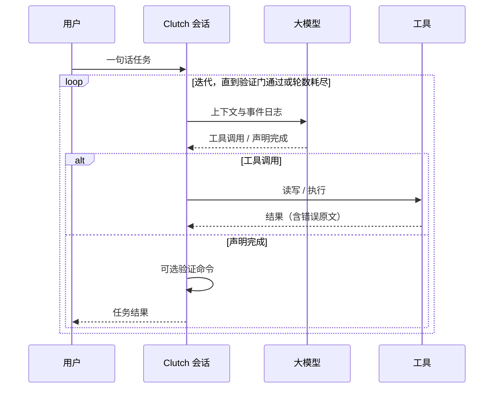

# Clutch

[](LICENSE)
[](https://github.com/Ethereal1024/Clutch/actions/workflows/release.yml)
[](pyproject.toml)

Clutch 是一个编程智能体：给它一句话任务，它会调用大语言模型，自主地读写文件、
执行命令、运行测试，直到任务完成或触发停止条件。

循环里的关键逻辑都是自己实现的：对话历史的维护、工具的定义与本地执行、模型输出的
解析、循环终止、错误处理，没有使用现成的 agent 框架或 SDK。模型通过 OpenAI 兼容的
tool-calling 接口调用（DeepSeek 等均可），需要自备 API key。

## 快速开始

需要 Python ≥ 3.10 和 Node.js，包管理用 uv。

```bash
pip install uv && uv sync    # 后端依赖
cd ui && npm install         # 前端依赖
export CLUTCH_API_KEY=...    # API key
npm start                    # 启动界面，后端由应用自动拉起
```

`npm run dev` 由脚本先起后端再起界面（自动清理端口占用），效果等同。只跑后端的话
也可以手动起：`uv run python -m agent.server --port 0`，`--verify "命令"` 可为任务
指定验证命令。

启动后在欢迎界面新建或打开一个 `.clc` 文件，输入任务即可开始对话。一个对话对应一个
`.clc` 文件，工作目录就是文件所在目录，重新打开即恢复整个对话。

模型、接口地址和 key 在界面的设置弹窗里填，也可以用环境变量 `CLUTCH_MODEL`、
`CLUTCH_BASE_URL`、`CLUTCH_API_KEY` 提供。

## 跨设备使用

在设置的 SSH 里填远端 host / user / port 即可连接，隧道由程序化 ssh2 建立（密码在
应用内输入，或用本机密钥）。远端不需要预装任何东西：客户端会按远端的系统和 Python
版本自动上传并运行后端（远端无需外网；没有 Python 的同架构机器用自包含二进制，其余
情况由模型引导安装）。远端每个窗口是一个独立会话，LLM 请求经隧道转发回客户端本地
反代，因此远端不需要 API key。



## 桌面版（Linux）

`scripts/release.sh` 把后端打成 PyInstaller 二进制，连同 Electron 界面打包成 deb，
目标机器不需要 Python / Node / 网络：

```bash
sudo dpkg -i clutch-ui_<版本>_amd64.deb
```

推送 vX.Y.Z 的 tag 会触发 CI 自动构建（见 `.github/workflows/release.yml`）。deb 内
的后端绑定构建机的系统与架构，跨平台场景建议用上面的 SSH 路径。

## 工作原理

前后端解耦：Electron 界面（`ui/`）与 Python 后端（`agent/`）通过 HTTP + SSE 通信。
后端由 supervisor 统一管理——每个窗口向 supervisor 申请一个独立会话（随机端口），
窗口关闭会话即停止，末窗退出后 supervisor 自动退出。



单个任务在会话里的执行循环：



几个设计选择：

- 事件流：会话日志、界面、回放都从同一条事件流派生，历史与上下文管理基于事件日志，
  而不是增量拼接的字符串。
- 验证门：任务可以附带一个验证命令（比如测试套件）。模型说"完成了"不算数，验证
  命令通过才判定成功；不附带则自然终止。
- 错误即数据：工具执行失败会连同错误原文喂回给模型，让它自己读错、自己修。
- 项目即文件：一个对话就是一个 `.clc` 文件，重新打开即恢复整个对话，没有集中的
  会话管理。
- Skills：系统提示里只列技能的名字和一句话描述，模型按需用 load_skill 拉取详情，
  基础提示保持精简。
- 权限确认：危险操作（`rm -rf`、写到项目目录之外）会弹确认框，由人决定放行或拒绝。

## 项目结构

```
agent/                 后端
  core/                上下文管理（context.py）、输出解析（parse.py）、
                       终止条件（terminate.py）、错误处理（errors.py）
  tools/               工具定义与本地执行：read_file / write_file / edit_file /
                       grep / run_command
  llm/                 OpenAI 兼容客户端（流式、重试、错误归一化）
  server.py            HTTP + SSE 服务（会话入口）
  supervisor.py        会话进程管理
  skills/              按需加载的领域知识
ui/                    Electron 前端（设置、SSH 隧道、LLM 反代）
eval/                  评测场景（落地页 / 修 bug / 重构）
tests/                 测试
scripts/               打包与构建脚本
```

## 测试

```bash
uv run python -m tests.selfcheck        # 核心逻辑自检
uv run python -m tests.loop_test        # 循环路径（假模型驱动，不消耗 API）
uv run python -m tests.server_test      # HTTP + SSE 端到端
uv run python -m tests.lazy_check       # 历史分页与惰性加载
uv run python -m tests.supervisor_test  # 会话生命周期与跨进程锁
uv run python -m tests.transport_test   # 传输层与远程工作区往返
uv run python -m eval.harness           # 三个评测场景
```

## 安全

- 命令默认在工作目录内运行，带超时与输出截断
- 路径逃逸有防护，危险操作需人工确认
- API key 通过环境变量或界面设置提供，不写入仓库

## License

MIT，见 [LICENSE](LICENSE)。
