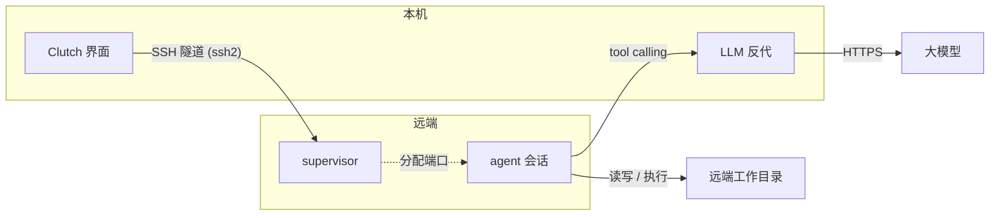
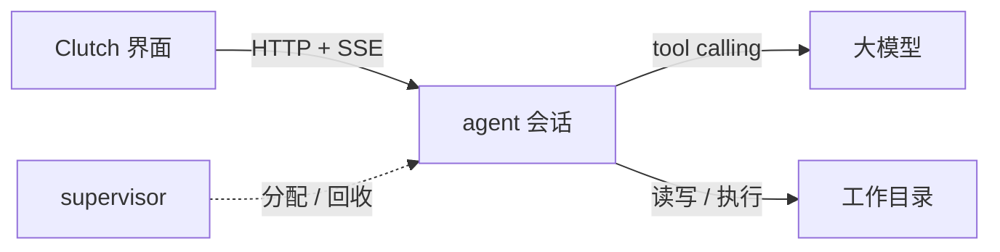
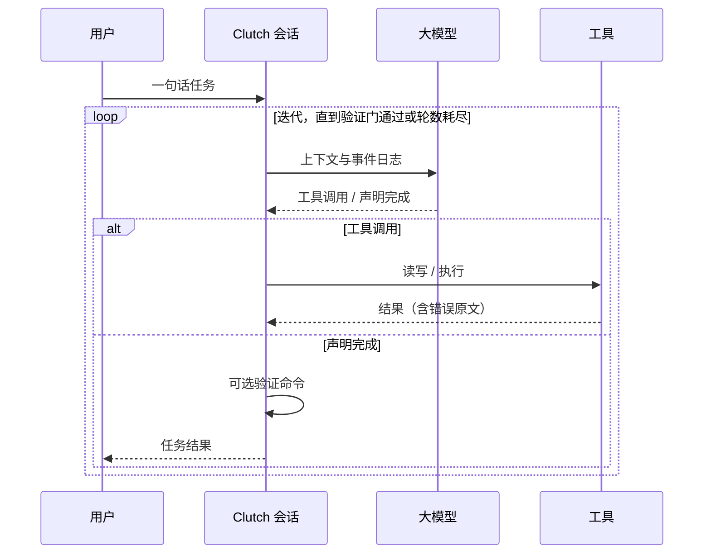

# Clutch

[](LICENSE)
[](https://github.com/Ethereal1024/Clutch/actions/workflows/release.yml)
[](https://github.com/Ethereal1024/Clutch/releases/latest)
[](pyproject.toml)

Clutch 是一个编程智能体：给它一句话任务，它会调用大语言模型，自主地读写文件、
执行命令、运行测试，直到任务完成或触发停止条件。

循环里的关键逻辑都是自己实现的：对话历史的维护、工具的定义与本地执行、模型输出的
解析、循环终止、错误处理，没有使用现成的 agent 框架或 SDK。模型通过 OpenAI 兼容的
tool-calling 接口调用（DeepSeek 等均可），需要自备 API key。

## 快速开始

需要 Python ≥ 3.10 和 Node.js，包管理用 uv。

```bash
git submodule update --init --recursive   # 四个工具模块（工具实现都在子模块里）
pip install uv && uv sync    # 后端依赖
cd ui && npm install         # 前端依赖
export CLUTCH_API_KEY=...    # API key
npm start                    # 启动界面，后端由应用自动拉起
```

`npm run dev` 由脚本先起后端再起界面（自动清理端口占用），效果等同。只跑后端的话
也可以手动起：`uv run python -m agent.server --port 0`，`--verify "命令"` 可为任务
指定验证命令。

启动后在欢迎界面新建或打开一个 `.clc` 文件，输入任务即可开始对话。一个对话对应一个
`.clc` 文件，工作目录就是文件所在目录，重新打开即恢复整个对话。

模型、接口地址和 key 在界面的设置弹窗里填，也可以用环境变量 `CLUTCH_MODEL`、
`CLUTCH_BASE_URL`、`CLUTCH_API_KEY` 提供。默认走 chat completions；同一个 base URL
同时提供 Responses API 的服务（如 DeepSeek 的 Codex 兼容端点）可在设置里把
「API protocol」切到 responses，工具调用与思考流不变。

联网搜索工具 `web_search` / `web_fetch` 开箱即用（内置 Bing RSS 免 key 后端）；可选
后端优先：`CLUTCH_TAVILY_API_KEY` 启用 Tavily，`CLUTCH_SEARXNG_URL` 指向自建 SearXNG。
抓取只支持文本页面，带 SSRF 防护（拒绝内网地址与重定向）。

## 跨设备使用

在设置的 SSH 里填远端 host / user / port 即可连接，隧道由程序化 ssh2 建立（密码在
应用内输入，或用本机密钥）。远端不需要预装任何东西：客户端会按远端的系统和 Python
版本自动上传并运行后端（远端无需外网；没有 Python 的同架构机器用自包含二进制，其余
情况由模型引导安装）。远端每个窗口是一个独立会话，LLM 请求经隧道转发回客户端本地
反代，因此远端不需要 API key。


```mermaid
flowchart LR
    subgraph local["本机"]
        UI["Clutch 界面"]
        PXY["LLM 反代"]
    end
    subgraph remote["远端"]
        SUP["supervisor"]
        S["agent 会话"]
    end
    UI -- "SSH 隧道 (ssh2)" --> SUP
    SUP -. "分配端口" .-> S
    S -- "tool calling" --> PXY
    PXY -- "HTTPS" --> LLM["大模型"]
    S -- "读写 / 执行" --> WS["远端工作目录"]
```

## 桌面版（Linux / macOS）

安装包发布在 GitHub Releases（顶部 Release 徽章直通最新版）：

**[https://github.com/Ethereal1024/Clutch/releases](https://github.com/Ethereal1024/Clutch/releases)**

**Linux**：下载 `clutch-ui_<版本>_amd64.deb`，目标机器不需要 Python / Node / 网络：

```bash
sudo dpkg -i clutch-ui_<版本>_amd64.deb
```

**macOS（Apple Silicon）**：下载 `Clutch-<版本>-arm64.dmg`，打开后把 Clutch.app 拖进
Applications。安装包未签名，首次打开会被 Gatekeeper 拦——**提示"已损坏，无法打开"
并不是文件真的坏了**，只是 macOS 对无签名 + 隔离标记应用的统一说辞（macOS 15 起连
右键 → 打开的入口也移除了）。任选一种方式放行：

```bash
# 方式一（推荐）：清除隔离标记后直接打开
xattr -cr /Applications/Clutch.app

# 方式二：先双击 Clutch 触发拦截，然后 系统设置 -> 隐私与安全性 ->
#         底部"安全性"里点 Clutch 的"仍要打开"

# 若上面之后仍提示损坏（少数机器），补一次 ad-hoc 重签：
codesign --force --deep --sign - /Applications/Clutch.app
```

构建：Linux 上 `bash scripts/release.sh`（deb）；Mac 上
`bash scripts/release-mac.sh [--install]`（dmg，`--install` 顺带装进
/Applications 并放行 Gatekeeper）。推送 vX.Y.Z 的 tag 会触发 CI 同时构建两者并
附加到 Release（见 `.github/workflows/release.yml`）。安装包内的后端绑定构建机的
系统与架构（mac 为 arm64），跨平台场景建议用上面的 SSH 路径。

## 工作原理

前后端解耦：Electron 界面（`ui/`）与 Python 后端（`agent/`）通过 HTTP + SSE 通信。
后端由 supervisor 统一管理——每个窗口向 supervisor 申请一个独立会话（随机端口），
窗口关闭会话即停止，末窗退出后 supervisor 自动退出。


```mermaid
flowchart LR
    UI["Clutch 界面"] -- "HTTP + SSE" --> S["agent 会话"]
    SUP["supervisor"] -. "分配 / 回收" .-> S
    S -- "tool calling" --> LLM["大模型"]
    S -- "读写 / 执行" --> WS["工作目录"]
```

单个任务在会话里的执行循环：


```mermaid
sequenceDiagram
    participant U as 用户
    participant A as Clutch 会话
    participant M as 大模型
    participant T as 工具

    U->>A: 一句话任务
    loop 迭代，直到验证门通过或轮数耗尽
        A->>M: 上下文与事件日志
        M-->>A: 工具调用 / 声明完成
        alt 工具调用
            A->>T: 读写 / 执行
            T-->>A: 结果（含错误原文）
        else 声明完成
            A->>A: 可选验证命令
            A-->>U: 任务结果
        end
    end
```

几个设计选择：

- 事件流：会话日志、界面、回放都从同一条事件流派生，历史与上下文管理基于事件日志，
  而不是增量拼接的字符串。
- 验证门：任务可以附带一个验证命令（比如测试套件）。模型说"完成了"不算数，验证
  命令通过才判定成功；不附带则自然终止。
- 错误即数据：工具执行失败会连同错误原文喂回给模型，让它自己读错、自己修。
- 项目即文件：一个对话就是一个 `.clc` 文件，重新打开即恢复整个对话，没有集中的
  会话管理。
- Skills：系统提示里只列技能的名字和一句话描述，模型按需用 load_skill 拉取详情，
  基础提示保持精简。
- 权限确认：危险操作（`rm -rf`、写到项目目录之外）会弹确认框，由人决定放行或拒绝。
  模型被这个弹窗挡住，所以回答只有两条明路——点按钮，或按 Enter 放行；点击弹窗外的
  空白不会关闭它，避免一次误点变成一次误拒。

## 项目结构

```
agent/                 宿主后端（会话循环 + 模型调用 + registry + 传输层）
  core/                上下文管理（context.py）、输出解析（parse.py）、
                       终止条件（terminate.py）、错误处理（errors.py）
  tools/               工具定义与调用：catalog.py（发现并合并各组件自带的
                       component.json 声明：工具名、参数、命令模板、它在界面里的
                       样子）、registry.py（声明 -> 模型可见的
                       工具，宿主只保留策略）、components.py（安装层：把组件落到
                       运行它的那台机器）、rendezvous.py（daemon/CLI 寻址与启动）、
                       inst.py（一次调用 = 一条终端命令）、transport.py、modules.py
  llm/                 OpenAI 兼容客户端（流式、重试、错误归一化）；keepalive.py
                       给连接打开内核探活，被静默丢包的请求 ~35s 就报错，不再等
                       240s 的读预算（选项装在后端上，走代理的连接也生效）
  browsing.py          目录浏览（项目选择器 + 工作区文件树，本地/SSH 双传输）
  server.py            HTTP + SSE 服务（会话入口，含 .clc 内容服务端点）
  supervisor.py        会话进程管理
ui/                    Electron 前端（设置、SSH 隧道、LLM 反代）；渲染层是
                       app.js + js/*，按 index.html 的脚本顺序加载
clutch-workspace/      文件工具模块（子模块）：read_file / grep / write_file /
                       edit_file 与 undo，per-workspace daemon
clutch-memory/         记忆模块（子模块）：save_memory / load_memory /
                       search_memory，消费宿主的 .clc 内容服务
clutch-websearch/      联网模块（子模块）：web_search / web_fetch，自带后端链
clutch-skills/         技能模块（子模块）：load_skill 与技能库（随包发布 4 个，
                       本机 dev-only 的写作技能不入库、也不进安装包）
eval/                  评测场景（落地页 / 修 bug / 重构）
tests/                 测试
scripts/               打包与构建脚本
```

四个工具模块都是独立仓库（submodule），形式不限（daemon / 一次性脚本 / CLI），
宿主不 import 它们的代码，只依赖它们发布的接口（HTTP 表面或 CLI 的 stdout 契约）：
`clutch-workspace` 每个工作区一个常驻 daemon，其余按需拉起。宿主里没有任何工具的第
二份实现，也没有任何内置声明——工具的名字、参数、命令模板，以及它在界面里的呈现
方式，全部写在组件自带的 `component.json` 里（随组件走，规范见
[COMPONENTS.md](COMPONENTS.md)），宿主只负责发现与合并。因此删掉任何一个
模块，宿主只会失去对应工具（工具表里不再出现），其余工具与会话循环不受影响；
一个组件都没装时，宿主只有 AI 聊天本身，没有可调用的文件/联网/记忆/技能工具。

组件由客户端上传到"要运行它的那台机器"的 supervisor（`POST /api/components/install`，
工件摘要对内容负责），落在该机器的用户目录里；宿主每次调用工具时按需解析，所以后台
晚装上的组件会被后续调用看到。第三方组件不必进主仓库：把一份声明 JSON 放进
`~/.clutch/components/catalog.d/`（或用同一个安装接口上传工件），声明里 `directory`
指向代码、`tools` 列出它发布的工具，它就会出现在工具表里。

工具在界面里的样子也是声明的一部分：每个工具事件都带上它组件声明的 `ui` 块，前端里
没有任何工具名。`ui` 的每个键只负责那一个部件：`chip`（行首那个工具名，默认打；
summary 已经把这次调用说清楚的 read/grep 把它关掉）、`summary`（那行的一行标签，
`{参数名}` / `{lines}` / `{name}` 由调用自己填，默认空 —— 行首的名字就是它）、
`preview`（调用流式进行时那行实时显示什么：原始参数 JSON / 参数自带的文本 / 解包后
的命令）、`header`（结果自成一块时那块的标题，空则退回 summary，再退回 `result`）、
`form`（结果是一整块还是折叠成一行）、`body`（结果正文是文本 / 代码面板 / diff /
不显示）、`highlight` / `chrome`（正文上的点缀：按 `path` 参数高亮、标题变成强调
色块）、`group`（同一组的调用密集合并成一块，所以
一串 read/grep 扫成一列单行，而 write 不会被打包进去）、`collapse`（折叠块怎么
收），宿主再补上只有它才知道的 `mutates` / `undo`。协议的定义与默认值见
`agent/tools/catalog.py` 顶部的说明（完整规范见
[COMPONENTS.md](COMPONENTS.md)），消费方是 UI 渲染层（`ui/app.js` 与 `ui/js/*`，
加载顺序见 `ui/index.html`；绘制这块表的是 `ui/js/tool-render.js`）。

## 测试

无框架，逐个模块跑；断言共享 `tests/testsupport.py`。下面就是全部套件（每个文件头部写明
它钉住的约定）：

```bash
# 离线：不联网、不要密钥、不花 API 额度
uv run python -m tests.selfcheck            # 核心逻辑自检
uv run python -m tests.loop_test            # 循环路径（假模型驱动）
uv run python -m tests.server_test          # HTTP + SSE 端到端
uv run python -m tests.lazy_check           # 历史分页与惰性加载
uv run python -m tests.supervisor_test      # 会话生命周期与跨进程锁
uv run python -m tests.transport_test       # 传输层与远程工作区往返
uv run python -m tests.remote_path_test     # 远端路径不得落到本机文件系统（macOS 回归）
uv run python -m tests.project_lock_test    # 只读项目锁：第二个进程抢锁会被拒 / 被杀死后能释放
uv run python -m tests.llm_client_test      # 两种线协议的流式错误与重试
uv run python -m tests.llm_keepalive_test   # 内核 keepalive：选项被本机接受，直连与走代理的连接都真落到 socket 上
uv run python -m tests.local_shell_test     # 本机 shell 决策（POSIX sh / Git Bash / cmd）
uv run python -m tests.inst_test            # 工具语句：参数 -> 命令 -> 信封
uv run python -m tests.rendezvous_test      # 模块 daemon/CLI 寻址与权限围栏（需 checkout）
uv run python -m tests.tools_inst_test      # 每个工具的命令契约（--live 走真实模块）
uv run python -m tests.catalog_test         # 组件声明：UI 协议 + 第三方注册（R4）
uv run python -m tests.hostconfig_test      # 宿主自己的文档（host.json）：access/gates/ui/backends 表
uv run python -m tests.components_api_test  # 组件安装层：客户端上传 + 宿主落地
uv run python -m tests.ui_fonts_check       # 字体/图标跨平台一致（含 mermaid 标签字体）
uv run python -m eval.harness               # 三个评测场景

# 需要一台真远端（见文件头：CLUTCH_E2E_HOST / _PORT / _USER / _PASS）
CLUTCH_E2E_HOST=10.x.x.x CLUTCH_E2E_USER=me CLUTCH_E2E_PASS=… node tests/remote-bootstrap-e2e.js
```

界面侧（事件流渲染 / 组件声明的 `ui` 协议 / SSH 隧道 / LLM 反代）同样无框架，
`node tests/<name>.test.js`，断言共享 `tests/harness.js`；清单就是 `tests/*test*.js`
（`remote-bootstrap-e2e.js` 需要真远端，其余离线）。

模块自己的套件在模块目录里跑：`cd clutch-skills && python3 -m pytest`（memory /
websearch / workspace 同理）。

## 安全

- 命令默认在工作目录内运行，带超时与输出截断
- 路径逃逸有防护，危险操作需人工确认
- API key 通过环境变量或界面设置提供，不写入仓库

## License

MIT，见 [LICENSE](LICENSE)。
