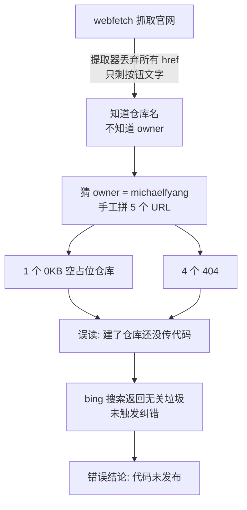

# Websearch / Webfetch 工具问题复盘：SRU 仓库 404 误判事件

- **事件会话**：2026-09-21（SRU 项目调研）
- **复盘日期**：2026-09-22
- **涉及文件**：`agent/tools/websearch.py`、`agent/config.py`
- **错误结论**：「SRU 官方代码未发布，仓库为空 / 404」
- **事实**：官方代码完整发布在 `leggedrobotics` 组织下，共 6 个仓库，全部有真实实现（见附录）

---

## TL;DR

1. **404 是真实的 HTTP 响应，但 URL 本身是错的**。webfetch 的文本提取器丢弃了页面上所有 `<a href>`，模型只知道仓库名、不知道仓库归属，于是猜 owner = 作者个人账号 `michaelfyang` 并手工拼 URL；官方代码实际在 `leggedrobotics` 组织下。
2. **个人账号下的同名空仓库是误导项**：`MichaelFYang/sru-pytorch-spatial-learning` 真实存在但 0KB（2025-12-31 建的占位），让错误猜测"看起来对了一部分"，于是四个 404 被解读成"还没发布"而不是"owner 猜错"。
3. **本该纠错的搜索也失效**：本机未配置 tavily/searxng，搜索链退化为 `('bing', 'ddg')`；ddg 网络不可达；bing RSS 对英文小众技术查询返回完全无关的中文结果，且 `_bing()` 无相关性校验——垃圾结果被当作成功**静默**返回。
4. **修复优先级**：webfetch 保留超链接（治本）≥ 配置 tavily（一行环境变量，立即见效）＞ 搜索相关性守卫。

---

## 1. 事件时间线

| # | 动作 | 结果 |
|---|------|------|
| 1 | webfetch 项目官网 | 正文正常，但所有 GitHub 按钮的链接地址被丢弃 |
| 2 | 模型猜测 owner = `michaelfyang`，拼出 5 个 URL | 4 个 404；1 个"空仓库" |
| 3 | 误读为「仓库已建、代码未传」 | 形成"代码未发布"的错误前提 |
| 4 | web_search 交叉验证 | bing 返回无关中文结果（知乎 / 粉笔 / 大学官网），未触发怀疑 |
| 5 | 基于错误前提输出"从零重实现"教学计划 | 错误传导到下游产出 |
| 6 | 次日用户提供 `leggedrobotics` 链接 | GitHub API 验证：6 仓库全部存在、非空、近期有 push |

## 2. 因果链



## 3. 根因分析

### 根因 A（治本点）：webfetch 丢弃全部链接

`agent/tools/websearch.py` 的 `_TextExtractor` 继承 `html.parser.HTMLParser`，`handle_starttag` 只看标签名、完全忽略 `attrs`：

- 页面里的 `<a href="https://github.com/leggedrobotics/sru-navigation-learning">GitHub</a>`
- 提取后只剩文字 `GitHub`

后果：模型拿到"仓库名 + 按钮文字"，拿不到 URL，只能自己构造。**"构造 URL"这个动作就是事故起点。**

### 根因 B：错误猜测 + 空仓库的巧合

- 项目官网托管在 `michaelfyang.github.io`，页脚链接作者个人主页 → 猜测仓库也在个人账号下
- ETH RSL 的实际惯例：正式代码发布在实验室 `leggedrobotics` 组织（`rsl_rl` 同样如此），个人账号只留占位
- 巧合：`MichaelFYang/sru-pytorch-spatial-learning` 真实存在（0KB，pushed 2025-12-31），错误猜测获得"部分验证"，于是停止怀疑 owner、转而怀疑"发布状态"

### 根因 C：搜索后端退化为"仅 bing"，且无质量守卫

设计链条（`_BACKENDS`）：`tavily → searxng → bing → ddg`，前两个高质量后端需要配置：

| 后端 | 激活条件 | 本机状态 |
|---|---|---|
| tavily | `CLUTCH_TAVILY_API_KEY` | ❌ 未设置 |
| searxng | `CLUTCH_SEARXNG_URL` | ❌ 未设置 |
| bing | 免 key | ✅ 唯一存活 |
| ddg | 免 key | ❌ `[Errno 101] Network is unreachable` |

bing 后端的具体问题：

- 请求 `www.bing.com/search?...&format=rss`（非官方接口；模块 docstring 写的是 `cn.bing.com`，与代码不一致——文档漂移）
- 默认请求头 `Accept-Language: zh-CN,zh;q=0.9,en;q=0.8`
- 实测对 `'michaelfyang sru-navigation-learning github'` 返回知乎 / 粉笔教资 / 吾爱破解等**完全无关**结果
- `_bing()` 只检查「RSS 里有 item」即返回成功，**没有相关性校验**

对比：ddg 解析不到结果时会抛 `BackendError` 触发链条回退；而 bing 的「有结果但全错」是最危险的失败模式——**静默错误**：链条就此终止，调用方无从得知质量已崩。

### 根因 D：webfetch 对重页面 15s 超时、无重试

`agent/config.py:72` — `web_search_timeout: float = 15.0`。超时有界是正确的 poka-yoke 设计，但 github.com 这类重页面偶发超时（复盘当日复现一次 "The read operation timed out"），无重试机制放大了偶发性。

## 4. 证据（全部可复现）

```bash
# ① 官网按钮真实链接 → 全部指向 leggedrobotics 组织
$ curl -sL https://michaelfyang.github.io/sru-project-website/ \
    | grep -oE 'href="https://github[^"]*"' | sort | uniq -c
  leggedrobotics/sru-robot-deployment
  leggedrobotics/sru-pytorch-spatial-learning
  leggedrobotics/sru-navigation-sim
  leggedrobotics/sru-navigation-learning
  leggedrobotics/sru-depth-pretraining
  leggedrobotics/rsl_rl
  isaac-sim/IsaacLab
  MichaelFYang/sru-project-website        # 官网源码仓库
  MichaelFYang                            # 作者个人主页

# ② 上次 404 的 URL 今天依然 Not Found（个人账号下从未存在）
$ curl -sL https://api.github.com/repos/michaelfyang/sru-navigation-sim | grep message
  "message": "Not Found",

# ③ 个人账号下的同名仓库是 0KB 占位
$ curl -sL https://api.github.com/repos/michaelfyang/sru-pytorch-spatial-learning \
    | grep -E '"size"|"pushed_at"'
  "pushed_at": "2025-12-31T15:37:49Z",
  "size": 0,

# ④ 搜索链实测：只剩 bing + ddg
>>> from agent.tools.websearch import available_backends
>>> available_backends(Config())
('bing', 'ddg')

# ⑤ 复现垃圾搜索（与事故会话同一查询、同一后端）
5 results for 'michaelfyang sru-navigation-learning github' (via bing):
1. 在粉笔工作是一种什么体验？ - 知乎
2. 粉笔申论和小马哥申论该听哪个？ - 知乎
3. 求一份2025下小学教资粉笔或中公的资料 ...
  （ddg: [Errno 101] Network is unreachable）
```

## 5. 修复建议

| 优先级 | 改动 | 位置 | 说明 |
|---|---|---|---|
| **P0** | 提取结果保留超链接：输出 `[text](url)` | `_TextExtractor` | ~10 行。模型从此拿到真实 URL，消灭"猜 URL"这个动作，**治本** |
| **P0** | 配置 `CLUTCH_TAVILY_API_KEY`（tavily.com 有免费额度） | 环境变量 | 零代码。tavily 回到链首，bing/ddg 自动降为兜底 |
| **P1** | 相关性守卫：查询关键词与结果 title/url 零重叠 → 抛 `BackendError` 走回退 | `web_search()` | ~15 行。把 bing 的静默错误变成可回退错误 |
| **P1** | bing 请求按查询语言调整市场参数（`ensearch=1` / `setlang`，或去掉 zh-CN 优先） | `_bing()` | 缓解中文市场垃圾结果 |
| **P2** | webfetch 超时重试 1 次；修正 docstring 的 `cn.bing.com` 漂移 | `_http_get` / 模块注释 | 边缘改进 |
| **P2** | 源码修复同步到打包版 | 构建流程 | 运行中的 server 是 `/opt/Clutch/resources/agent-server`（PyInstaller 打包），只改 `~/Workspace/Clutch` 源码不会生效，需重打包/重装 |

## 6. 附录：SRU 官方仓库真实状态（2026-09-22，GitHub API）

| 仓库 | 内容 | 最近 push |
|---|---|---|
| `leggedrobotics/sru-navigation-learning` | RL 训练框架（含 `rsl_rl/`） | 2026-07-13 |
| `leggedrobotics/sru-navigation-sim` | IsaacLab 扩展（`isaaclab_nav_task/`） | 2026-07-13 |
| `leggedrobotics/sru-pytorch-spatial-learning` | SRU 核心模块（`network/`、`run_pointcloud.py`） | 2026-01-05 |
| `leggedrobotics/sru-depth-pretraining` | 深度预训练（ONNX 导出、`train_single.py`） | 2026-03-17 |
| `leggedrobotics/sru-robot-deployment` | B2W 实机部署（`rl_nav_controller/`、ROS2 脚本） | 2026-07-10 |
| `leggedrobotics/sru-path-aware-rl` | 官网未列；submodule 聚合以上仓库 | 2026-07-30 |

> 注：官网 Code 区只列了前 5 个；`sru-path-aware-rl` 是组织下新出现的聚合仓库，clone 它可一次性拉齐全部子仓库。

## 7. 一句话结论

工具没有"坏"——是三个设计缺口在特定网络环境（无搜索 API 配置 + ddg 不可达 + bing 中文市场）下的叠加：**链接信息丢失迫使模型猜 URL；免 key 后端质量无守卫；高质量后端未配置**。修掉前两条，此类误判从机制上消除，而不依赖模型当次发挥。
